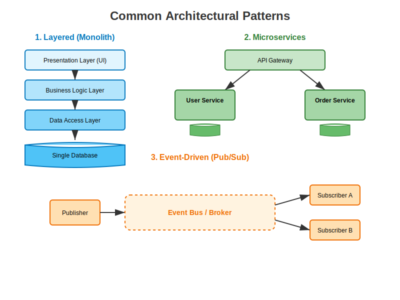

# Common Architectural Patterns 🏛️

Software Architecture Patterns are reusable solutions to commonly occurring problems in software design. They provide a high-level structure for how the system's components behave and interact.



---

## 1. Layered Architecture (N-Tier) 🍰

This is the most standard pattern, often used for Monolithic applications. It organizes code into horizontal layers, where each layer performs a specific role.

*   **Presentation Layer**: The UI (User Interface).
*   **Business Logic Layer**: The rules and calculations.
*   **Data Access Layer (DAL)**: Communicates with the database.
*   **Database Layer**: The actual storage (SQL/NoSQL).

### ✅ Pros & ❌ Cons
*   ✅ **Simple**: Easy to understand and test.
*   ✅ **Separation of Concerns**: UI doesn't know about SQL.
*   ❌ **Tight Coupling**: Changes in the database might ripple up to the UI.
*   ❌ **Scalability**: You have to scale the *entire* application, not just one part.

---

## 2. Microservices Architecture 🐝

The application is broken down into small, independent services. Each service runs in its own process and communicates with lightweight mechanisms (HTTP/REST or gRPC).

*   **Decentralized**: Each service has its own database.
*   **Independent Deployment**: You can update the "User Service" without redeploying the "Order Service".

### ✅ Pros & ❌ Cons
*   ✅ **Scalability**: Scale only what is needed.
*   ✅ **Flexibility**: Different services can use different languages (Python, Go, Java).
*   ❌ **Complexity**: Managing distributed systems is hard (Network latency, data consistency).
*   ❌ **Operational Overhead**: Needs DevOps (Kubernetes, Docker).

---

## 3. Event-Driven Architecture (EDA) 📡

Components communicate by emiting "Events" (e.g., "OrderPlaced") rather than calling each other directly.

*   **Producer**: Sends an event.
*   **Event Bus (Broker)**: Example: Kafka, RabbitMQ.
*   **Consumer**: Listens for relevant events and reacts.

### ✅ Pros & ❌ Cons
*   ✅ **Decoupling**: Producers don't know who consumers are.
*   ✅ **Responsiveness**: Great for real-time systems.
*   ❌ **Debuggability**: Hard to trace the flow of execution.
*   ❌ **Complexity**: Handling event ordering and delivery guarantees.

---

## 4. Client-Server & Peer-to-Peer 💻

*   **Client-Server**: Centralized. Clients request, Server responds. (Web Browsers -> Web Servers).
*   **Peer-to-Peer (P2P)**: Decentralized. Every node is both a client and a server. (BitTorrent, Blockchain).

---

## 5. Model-View-Controller (MVC) 🎨

A standard for UI applications (Web & Mobile).
*   **Model**: The data.
*   **View**: The display.
*   **Controller**: The glue that updates the Model based on User Input.

---

## 🐍 Python Simulation

Run the included simulation to see the difference between **Monolithic Processing** (Layered) and **Distributed Processing** (Event-Driven):

```bash
python arch_simulation.py
```
