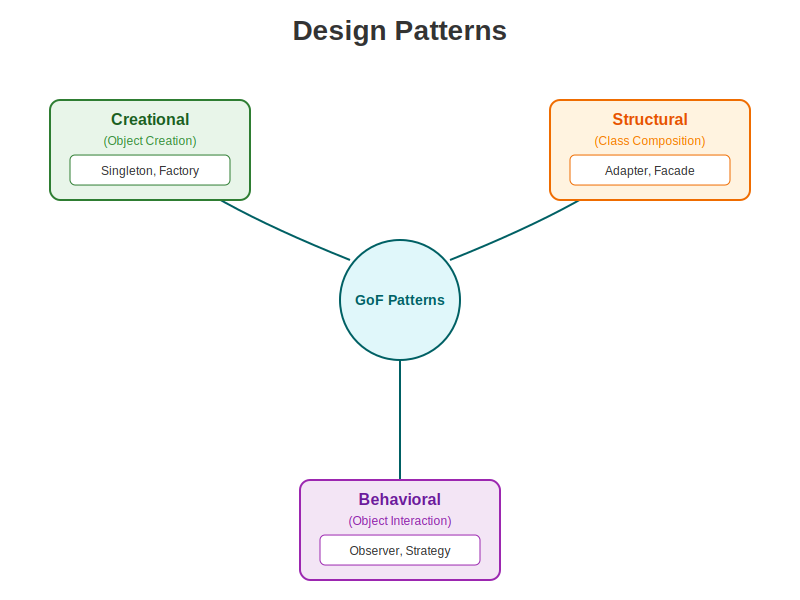

# Design Patterns (GoF) 🧩

Design Patterns are typical solutions to commonly occurring problems in software design. They are like blueprints that you can customize to solve a particular design problem in your code.



---

## 1. Creational Patterns (Building Objects) 🏭

### Singleton 🧍
**Goal**: Ensure a class has only one instance and provide a global point of access to it.
*   **Analogy**: The President of a country. There can only be one active at a time.
*   **Use Case**: Database Connection Pool, Configuration Manager, Logger.

### Factory Method 🏭
**Goal**: Define an interface for creating an object, but let subclasses decide which class to instantiate.
*   **Analogy**: A Logistics company. You say "Deliver this", and the manager decides whether to create a `Truck` (road) or `Ship` (sea) object.
*   **Use Case**: Cross-platform UI elements (WindowsButton vs MacButton).

---

## 2. Structural Patterns (Connecting Objects) 🔗

### Adapter 🔌
**Goal**: Allow objects with incompatible interfaces to collaborate.
*   **Analogy**: A Travel Adapter. It allows your US-plug laptop to work with a UK-socket wall.
*   **Use Case**: Integrating a 3rd party XML library into your JSON-based system.

### Facade 🏛️
**Goal**: Provide a simplified interface to a library, a framework, or any other complex set of classes.
*   **Analogy**: A Smart Home Panel. You press "Movie Mode", and it dims lights, turns on TV, and locks doors. You don't need to touch 10 different switches.
*   **Use Case**: Simplify interactions with a complex underlying subsystem (e.g., Compiler, Game Engine).

---

## 3. Behavioral Patterns (Object Communication) 🗣️

### Observer 👀
**Goal**: Define a subscription mechanism to notify multiple objects about any events that happen to the object they're observing.
*   **Analogy**: Subscribing to a Newsletter. When a new issue is out, all subscribers get it automatically.
*   **Use Case**: Event Handling systems, UI updates when Model changes (MVC).

### Strategy ♟️
**Goal**: Define a family of algorithms, put each of them into a separate class, and make their objects interchangeable.
*   **Analogy**: Getting to the airport. You can choose a "Strategy": Bus, Taxi, or Bike. The goal is the same, but the execution is different.
*   **Use Case**: Sorting algorithms (QuickSort vs MergeSort), Route planning, Payment methods (CreditCard vs PayPal).

---

## 🐍 Python Simulation

Run the simulation to see these patterns working together in a **Smart Home** scenario:

```bash
python patterns_simulation.py
```
