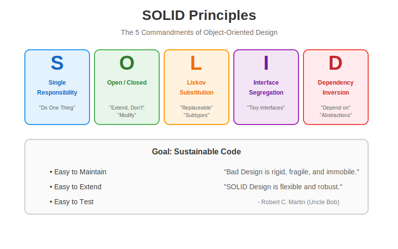

# SOLID Principles 🧱

The **SOLID Principles** are five design principles intended to make software designs more understandable, flexible, and maintainable. They were introduced by Robert C. Martin (Uncle Bob).



---

## 1. **S** - Single Responsibility Principle (SRP)
> "A class should have one, and only one, reason to change."

*   **Bad**: A `User` class that handles database application, email sending, AND user logic.
*   **Good**: A `User` class, `UserRepository` (DB), and `EmailService` (Email).
*   **Benefits**: Easier to test, lower coupling.

## 2. **O** - Open/Closed Principle (OCP)
> "Objects or entities should be open for extension but closed for modification."

*   **Bad**: Modifying a huge `switch` statement every time you add a new shape.
*   **Good**: Using inheritance/polymorphism (`Shape.draw()`) so you just add a new class `Circle` without touching existing code.
*   **Benefits**: Reduces chance of bugs in existing code.

## 3. **L** - Liskov Substitution Principle (LSP)
> "Objects of a superclass shall be replaceable with objects of its subclasses without breaking the application."

*   **Bad**: A `Square` class inheriting from `Rectangle` but changing the behavior of `setWidth` (breaking geometry rules).
*   **Good**: `Square` and `Rectangle` are separate or share a common `Shape` interface ensuring behavior consistency.
*   **Benefits**: Reliability, Predictability.

## 4. **I** - Interface Segregation Principle (ISP)
> "Clients should not be forced to depend upon interfaces that they do not use."

*   **Bad**: One massive `ISmartDevice` interface with `print()`, `fax()`, `scan()`. A simple Printer has to implement `scan()` strictly to satisfy the interface.
*   **Good**: Split into `IPrinter`, `IScanner`, `IFax`.
*   **Benefits**: Decoupling, Cleaner code.

## 5. **D** - Dependency Inversion Principle (DIP)
> "Depend upon abstractions, [not] concretions."

*   **Bad**: A `LightSwitch` class directly doing `new Bulb()`. It can *only* work with that specific Bulb.
*   **Good**: `LightSwitch` accepts an `ISwitchable` interface. You can pass in a Bulb, a Fan, or a Motor.
*   **Benefits**: Flexibility, Testability (Mocking).

---

## 🐍 Python Simulation

Run the simulation to see **Bad Code** vs **Good Code** (SOLID Compliant):

```bash
python solid_simulation.py
```
