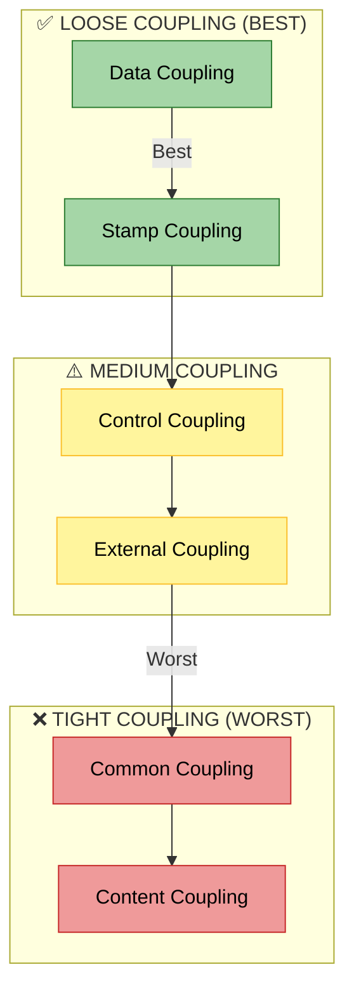
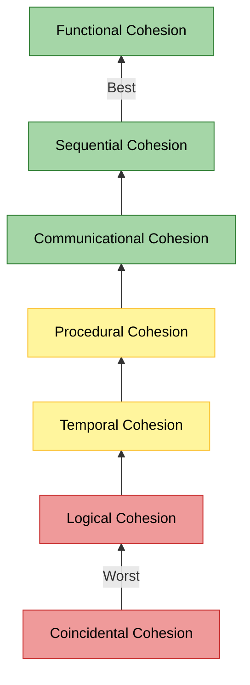

# Coupling and Cohesion 🔗

> **"High Coupling and Low Cohesion should be avoided. Low Coupling and High Cohesion should be the goal."**

Coupling and Cohesion are the two most critical metrics for determining the architectural quality of a software system. They measure how modules interact with each other (Coupling) and how elements within a module interact (Cohesion).


---

## 🏗️ Design Concept & Technical Design

Software design is a two-step iterative process involving **Conceptual Design** (for customers) and **Technical Design** (for builders).

| Aspect | **Conceptual Design** 🧠 | **Technical Design** ⚙️ |
|:---:|:---|:---|
| **Audience** | Customer / Stakeholder | System Builder / Developer |
| **Language** | Simple, Non-technical | Technical, Jargon-heavy |
| **Focus** | Functionality ("What it does") | Implementation ("How it does it") |
| **Content** | System characteristics, Requirements | Architecture, Data structures, APIs |
| **Independence**| Implementation Independent | Implementation Dependent |

---

## 🔗 Coupling (Interdependence)

**Coupling** refers to the degree of interdependence between software modules.
- 🔴 **High Coupling (Tight)**: Modules are glued together. A change in one breaks the other.
- 🟢 **Low Coupling (Loose)**: Modules connect via well-defined interfaces. They are independent.

### Types of Coupling (Best to Worst)

The goal is to keep coupling as "Loose" (Top/Green) as possible.



#### Detailed Descriptions

1.  **✅ Data Coupling**: Modules share data through parameters. Cleanest form.
2.  **✅ Stamp Coupling**: Modules share a data structure (e.g., passing a User object instead of just user_id).
3.  **⚠️ Control Coupling**: One module controls the flow of another (e.g., passing a "flag" to tell a function what to do).
4.  **⚠️ External Coupling**: Dependency on external devices, protocols, or formats.
5.  **❌ Common Coupling**: Modules share global data. Hard to track changes.
6.  **❌ Content Coupling**: One module directly modifies the internals of another. **Avoid at all costs.**

**Other Types:**
- **Temporal Coupling**: Dependency on timing (A must run before B).
- **Sequential Coupling**: Output of A is input of B.
- **Communicational Coupling**: Sharing a message queue or database.

---

## 🧩 Cohesion (Functional Strength)

**Cohesion** refers to how strongly the elements *inside* a module belong together.
- 🟢 **High Cohesion**: A module does **one thing** and does it well.
- 🔴 **Low Cohesion**: A module does random, unrelated things.

### Types of Cohesion (Best to Worst)

The goal is to aim for "Functional" (Top/Green) Cohesion.



#### Detailed Descriptions

1.  **✅ Functional Cohesion**: Every element contributes to a single, specific task (e.g., `calculate_tax()`).
2.  **✅ Sequential Cohesion**: Output of one part is input to the next (e.g., pipeline).
3.  **✅ Communicational Cohesion**: Elements operate on same data (e.g., `read_record`, `write_record`).
4.  **⚠️ Procedural Cohesion**: Elements grouped by execution order but weak relation.
5.  **⚠️ Temporal Cohesion**: Elements executed at the same time (e.g., `initialization` routines).
6.  **❌ Logical Cohesion**: Logically related but functionally different (e.g., a massive `input_handler` that handles mouse, keyboard, and network).
7.  **❌ Coincidental Cohesion**: Random grouping. No real relationship.

---

## ⚖️ Advantages & Disadvantages

| **Metric** | **Low Coupling / High Cohesion (GOAL)** | **High Coupling / Low Cohesion (BAD)** |
| :--- | :--- | :--- |
| **Maintainability** | ✅ Easy to modify single modules | ❌ Changes ripple through system |
| **Testing** | ✅ Easy to unit test in isolation | ❌ Hard to test without dependencies |
| **Reusability** | ✅ Modules are portable | ❌ Plug one, pull the whole system |
| **Readability** | ✅ Clear purpose | ❌ Spaghetti logic |
| **Complexity** | ✅ Reduced (Divide & Conquer) | ❌ Increased (Everything connects to everything) |

---

## 🐍 Python Simulation

Run the included simulation to see the impact of coupling and cohesion in code:

```bash
python coupling_cohesion_simulation.py
```

The simulation compares:
1.  **A "Spaghetti" System**: High Coupling (Global variables) & Low Cohesion (God object).
2.  **A "Modular" System**: Low Coupling (Interfaces) & High Cohesion (Single Responsibility).

---

*Part of Software Architecture & Design Principles*
