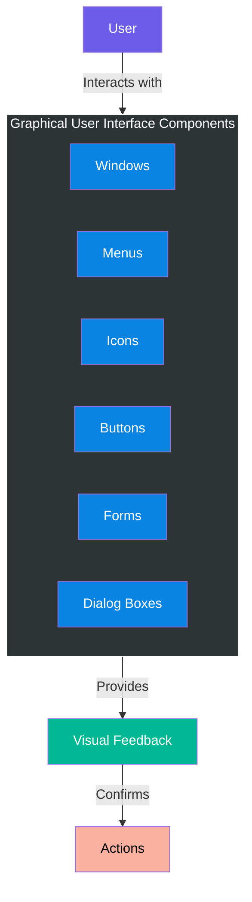
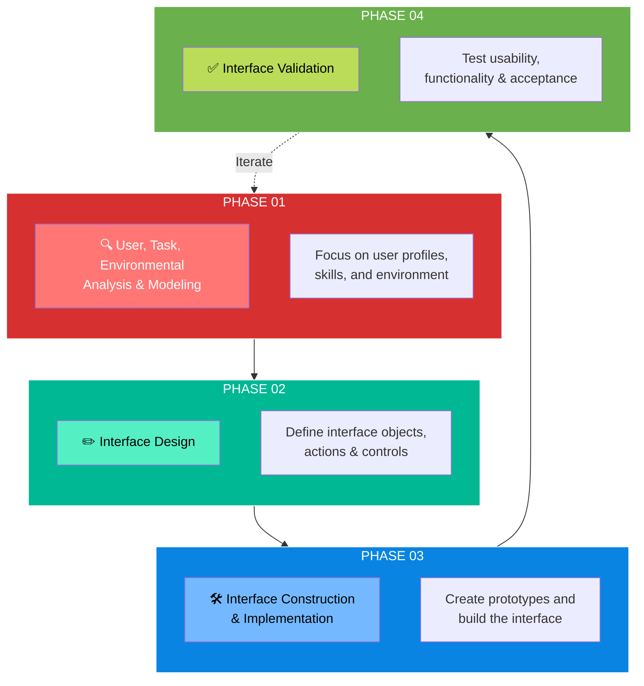
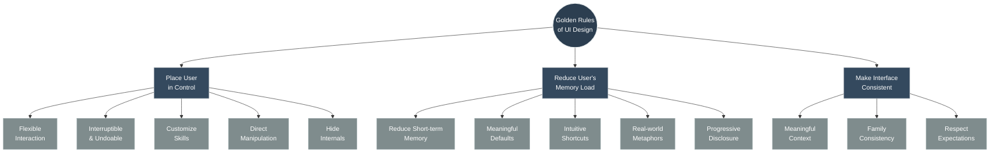
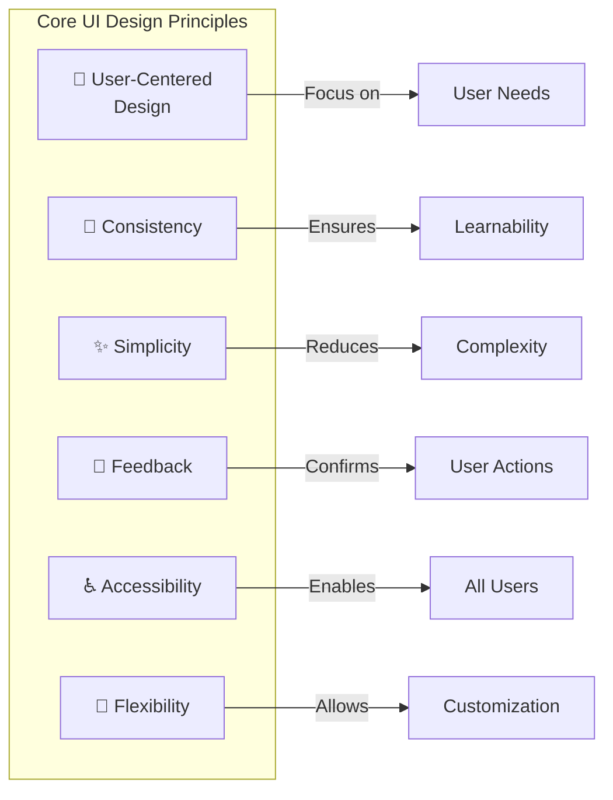
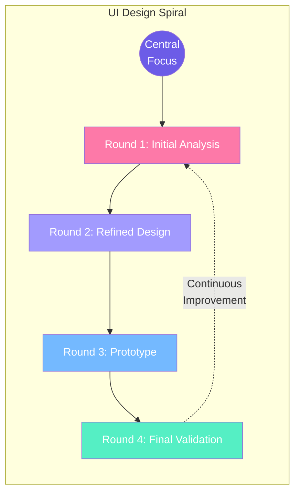
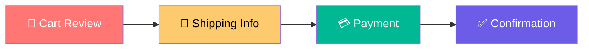

# User Interface Design 🎨

> **"The user interface is the front-end application view to which the user interacts to use the software."**

User Interface (UI) Design is a critical aspect of software engineering that directly impacts user satisfaction, productivity, and overall software success. A well-designed interface serves as the bridge between users and the system's functionality.

---

## 🌟 Characteristics of a Good User Interface

A software application becomes popular and successful when its user interface exhibits these qualities:

| Characteristic | Description |
|----------------|-------------|
| **Attractive** | Visually appealing design that engages users |
| **Simple to Use** | Intuitive navigation requiring minimal learning |
| **Responsive** | Quick feedback and minimal wait times |
| **Clear to Understand** | Unambiguous labels, icons, and messaging |
| **Consistent** | Uniform design patterns across all screens |


---

## 📊 Types of User Interface

### 1. Command Line Interface (CLI)

```
┌────────────────────────────────────────────────────────────┐
│ C:\Users\Admin>                                            │
│ C:\Users\Admin> dir                                        │
│  Volume in drive C is Windows                              │
│  Directory of C:\Users\Admin                               │
│                                                            │
│ 01/15/2026  09:30 AM    <DIR>          Documents           │
│ 01/15/2026  09:30 AM    <DIR>          Downloads           │
│ C:\Users\Admin> _                                          │
└────────────────────────────────────────────────────────────┘
```

**Characteristics:**
- Provides a command prompt for user input
- User must remember command syntax
- Powerful for advanced operations
- Faster for experienced users
- Examples: Terminal, PowerShell, Bash

### 2. Graphical User Interface (GUI)

**Characteristics:**
- Interactive visual elements (buttons, menus, icons)
- WYSIWYG (What You See Is What You Get)
- Point-and-click interaction
- Lower learning curve
- Examples: Windows Explorer, Web Browsers, Mobile Apps



---

## 🔄 User Interface Design Process

The UI design process is **iterative** and follows a **spiral model** approach. It consists of four main framework activities that continuously refine the interface.



### Phase 1: User, Task, Environmental Analysis & Modeling

**Focus Areas:**
- **User Profiles**: Understanding skill levels, knowledge, and user categories
- **Task Analysis**: Identifying tasks users perform to achieve goals
- **Environmental Factors**: Analyzing the physical work environment

**Key Environmental Questions:**
> - Where will the interface be located physically?
> - Will the user be sitting, standing, or performing other tasks?
> - Does the hardware accommodate space, light, or noise constraints?
> - Are there special human factors driven by environmental factors?

### Phase 2: Interface Design

**Goals:**
- Define interface objects and control mechanisms
- Specify how controls affect the system
- Define action sequences (user scenarios)
- Indicate system states during user tasks

### Phase 3: Interface Construction & Implementation

**Activities:**
- Create prototypes for usage scenario evaluation
- Use UI toolkits for building windows, menus, dialogs
- Implement device interactions and error handling
- Develop help facilities

### Phase 4: Interface Validation

**Testing Criteria:**
- ✅ Performs tasks correctly
- ✅ Handles variety of scenarios
- ✅ Meets all user requirements
- ✅ Easy to use and learn
- ✅ Accepted by users as useful

---

## 🏆 Theo Mandel's Golden Rules of UI Design

These three fundamental principles form the foundation of effective user interface design:



### 1️⃣ Place the User in Control

| Principle | Description |
|-----------|-------------|
| **Flexible Modes** | Don't force users into unnecessary actions; easy mode entry/exit |
| **Multiple Interactions** | Support keyboard, mouse, touch, voice commands |
| **Interruptible Actions** | Allow interruption and resumption of task sequences |
| **Undoable Operations** | Every action should be reversible |
| **Skill Customization** | Advanced users can customize the interface |
| **Hide Internals** | Shield users from technical complexity |
| **Direct Manipulation** | Objects on screen should be directly manipulated |

### 2️⃣ Reduce the User's Memory Load

| Principle | Description |
|-----------|-------------|
| **Minimize Short-term Memory** | Don't make users remember previous actions |
| **Meaningful Defaults** | Provide sensible initial values |
| **Intuitive Shortcuts** | Use memorable mnemonics (Ctrl+S = Save) |
| **Real-world Metaphors** | Use familiar concepts (folders, trash, desktop) |
| **Progressive Disclosure** | Show details on demand, not all at once |

### 3️⃣ Make the Interface Consistent

| Principle | Description |
|-----------|-------------|
| **Task Context** | Help users understand where they are |
| **Application Family** | Maintain consistency across related apps |
| **Honor Expectations** | Don't change established patterns without reason |
| **Predictable Behavior** | Same actions should produce same results |

---

## 🎯 Key Design Principles Summary



### Detailed Principles

1. **User-Centered Design**
   - Focus on user needs and preferences
   - Understand goals, tasks, and context
   - Design for user expectations

2. **Consistency**
   - Use consistent icons, colors, and navigation
   - Apply uniform patterns across the application
   - Help users predict behavior

3. **Simplicity**
   - Clear and concise language
   - Intuitive navigation
   - Remove unnecessary complexity

4. **Feedback**
   - Visual cues for actions
   - Confirmation messages
   - Progress indicators
   - Audio feedback when appropriate

5. **Accessibility**
   - Adequate color contrast
   - Scalable fonts
   - Screen reader compatibility
   - Keyboard navigation

6. **Flexibility**
   - Customizable preferences
   - Multiple ways to accomplish tasks
   - Adaptive to user expertise

---

## 🔬 UI Design Spiral Model

The iterative nature of UI design is best represented by the spiral model:



Each iteration through the spiral:
1. **Expands understanding** of user requirements
2. **Refines** the design based on feedback
3. **Validates** against user expectations
4. **Improves** usability and functionality

---

## 📖 Real-World Examples

### Example 1: E-Commerce Checkout Flow



**Applied Principles:**
- **Consistency**: Same button styles throughout
- **Feedback**: Progress indicator shows current step
- **Memory Load**: Auto-fill shipping from profile
- **User Control**: Edit buttons on each section

### Example 2: Mobile Banking App

**Applying Golden Rules:**
- 🎛️ **User Control**: Biometric login, quick actions on home screen
- 🧠 **Memory Load**: Saved payees, recent transactions visible
- 🔄 **Consistency**: Same navigation pattern as web version

---

## 💻 Running the Simulation

A Python simulation is provided to interactively explore UI design concepts:

```bash
# Run the simulation
python ui_design_simulation.py
```

The simulation demonstrates:
- The four phases of UI design
- Interactive decision-making scenarios
- Feedback and validation concepts
- Real-world UI pattern examples

---

## 📚 Summary

> **User Interface Design** is not just about aesthetics—it's about creating an effective bridge between users and functionality.

**Key Takeaways:**
1. ✅ Always design with the user in mind
2. ✅ Follow the four-phase iterative process
3. ✅ Apply Theo Mandel's three golden rules
4. ✅ Test, validate, and iterate continuously
5. ✅ Balance aesthetics with usability

---

## 🔗 References

- Pressman, R. S. - Software Engineering: A Practitioner's Approach
- Mandel, T. - The Elements of User Interface Design
- Nielsen, J. - Usability Engineering
- Norman, D. - The Design of Everyday Things

---

*Part of the Software Architecture Learning Series*
