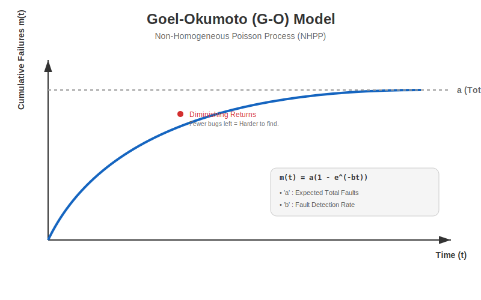

# Goel-Okumoto (G-O) Model 📉

The **Goel-Okumoto (G-O) Model** (1979) is one of the most widely used **Non-Homogeneous Poisson Process (NHPP)** models. It assumes that the number of faults detected follows a Poisson distribution with a mean value function that grows over time but eventually flattens out (saturates).



---

## 🧠 Key Assumptions

1.  **Constant Detection Rate**: The rate at which faults are detected is proportional to the number of remaining faults.
2.  **Imperfect Debugging? No**: Unlike PNZ, the basic G-O model usually assumes simpler debugging where faults are removed without introducing significant new ones (though extensions exist).
3.  **NHPP**: The failure intensity decreases over time as faults are removed.

---

## 📐 Mathematical Formulation

### 1. Mean Value Function $m(t)$
The expected number of failures detected by time $t$:

$$ m(t) = a(1 - e^{-bt}) $$

Where:
*   $a$: Expected total number of faults in the system (the asymptote).
*   $b$: The fault detection rate (per fault).
*   $t$: Time.

### 2. Failure Intensity $\lambda(t)$
The rate of failure at time $t$ (derivative of $m(t)$):

$$ \lambda(t) = a b e^{-bt} $$

As $t \to \infty$, $\lambda(t) \to 0$. The system becomes reliable.

---

## 🆚 Comparison

| Feature | **Jelinski-Moranda (J-M)** | **Goel-Okumoto (G-O)** | **PNZ Model** |
| :--- | :--- | :--- | :--- |
| **Type** | Binomial / Step Function | Poisson (NHPP) / Continuous | Poisson (NHPP) / S-Curve |
| **Fail Rate** | $\phi(N-i)$ (Steps) | $abe^{-bt}$ (Exp Decay) | S-Shaped |
| **Best For** | Early, small systems | General purpose, stable testing | Complex systems, learning curve |

---

## 🐍 Python Simulation

Run the simulation to see the cumulative failures curve:

```bash
python go_simulation.py
```
