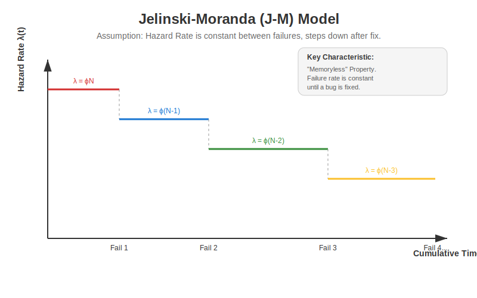

# Jelinski-Moranda (J-M) Model 📉

The **Jelinski-Moranda (J-M) Model** (1972) is one of the earliest and most fundamental software reliability models. It assumes that the software has a fixed number of bugs, and every time a bug is fixed, the reliability improves by a constant step.



---

## 🧠 Key Assumptions

1.  **Finite Faults**: There are $N$ total faults in the software initially.
2.  **Perfect Debugging**: When a failure occurs, the fault is removed instantly and perfectly (no new bugs introduced).
3.  **Constant Failure Rate**: Between failures, the random probability of hitting a bug is constant. It depends only on how many bugs are left.

---

## 📐 Mathematical Formulation

### 1. Hazard Rate (Failure Intensity)
The failure rate $\lambda$ is proportional to the number of remaining faults.

$$ \lambda(t) = \phi [N - (i - 1)] $$

Where:
*   $N$: Initial total number of faults.
*   $\phi$ (phi): Proportionality constant (size/complexity of code).
*   $i$: The current failure number ($1, 2, ... N$).

### 2. Failure Probability (PDF)
The time between failures ($t_i$) follows an **Exponential Distribution**:

$$ f(t_i) = \lambda_i e^{-\lambda_i t_i} $$

### 3. Reliability Function
The probability of NO failure for time $t$:

$$ R(t) = e^{-\lambda_i t} $$

---

## 🔍 J-M vs Schick-Wolverton (S-W)

*   **J-M Model**: "Memoryless". It doesn't matter if the software has been running for 1 hour or 100 hours; if no bug was found, the chance of finding one in the next minute is the same. The hazard rate is a set of **Horizontal Steps**.
*   **S-W Model**: "Stress building". The longer it runs, the higher the chance of failure. The hazard rate is a set of **Rising Slopes** (Sawtooth).

---

## 🐍 Python Simulation

Run the simulation to see how the Mean Time Between Failures (MTBF) increases as we fix bugs:

```bash
python jm_simulation.py
```
