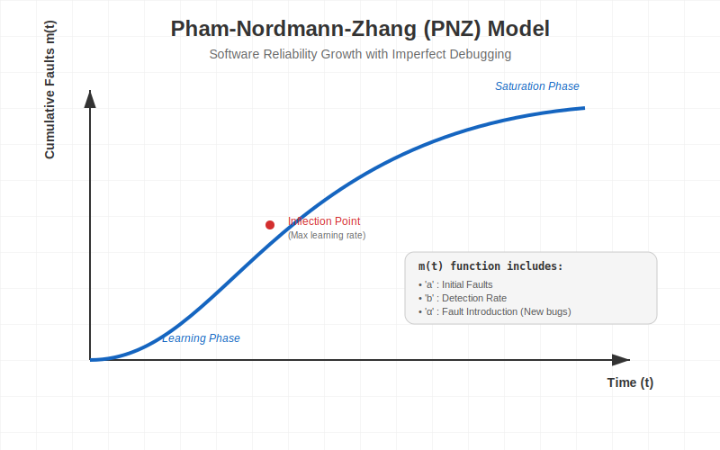

# Pham-Nordmann-Zhang (PNZ) Model 📉

The **PNZ Model** is a sophisticated **Software Reliability Growth Model (SRGM)** based on the Non-Homogeneous Poisson Process (NHPP). It is widely regarded as one of the best models for predicting reliability in complex software systems because it accounts for real-world factors that simpler models ignore.



---

## 🧠 Key Concepts

Unlike basic models that assume fault removal is perfect and constant, PNZ introduces:

1.  **S-Shaped Testing Curve** 🐍: It recognizes that testers learn as they go.
    *   **Start**: Testing is slow as testers learn the system.
    *   **Middle**: Testing accelerates (max efficiency).
    *   **End**: Testing slows down as faults become harder to find.
2.  **Imperfect Debugging** 🐛: It assumes that while fixing one bug, developers might accidentally **introduce new bugs** (Fault Introduction Rate $\alpha$).
3.  **Variable Detection Rate**: The rate of finding bugs changes over time ($b(t)$).

---

## 📐 The Mathematical Model

The mean value function $m(t)$ (expected number of faults detected by time $t$) is given by:

$$ m(t) = \frac{a(1 - e^{-bt})(1 - \frac{\alpha}{\beta}) + \alpha t}{1 + \beta e^{-bt}} $$

### Parameters:
*   **$a$**: Initial number of faults in the software.
*   **$b$**: Use rate (or fault detection rate).
*   **$\beta$**: Inflection factor (shape parameter for the S-curve).
*   **$\alpha$ (alpha)**: Fault introduction rate (new faults per detected fault).

---

## 🎯 Objectives

1.  **Predict Dependability**: Estimate when the software will be reliable enough to release.
2.  **Optimize Testing**: Determine if more testing is worth the cost.
3.  **Cost-Benefit Analysis**: Balance the cost of testing vs. the cost of failure.
4.  **Decision Support**: Help managers decide "Is it ready?"

---

## ⚖️ Advantages vs Disadvantages

| **Advantages** ✅ | **Disadvantages** ❌ |
| :--- | :--- |
| **High Accuracy**: Accounts for learning curve and new bugs. | **Complex**: Harder to calculate than simple exponential models. |
| **Realistic**: Models "Imperfect Debugging" (human error). | **Data Hungry**: Needs a lot of historical data to estimate $\alpha$ and $\beta$. |
| **Flexible**: Adapts to different development environments. | **Sensitivity**: Small changes in assumptions affect predictions. |
| **Specific Focus**: Good for component-based systems. | **Categorization**: Hard to classify faults perfectly. |

---

## 🐍 Python Simulation

Run the included simulation to see the PNZ model calculation in action:

```bash
python pnz_simulation.py
```
