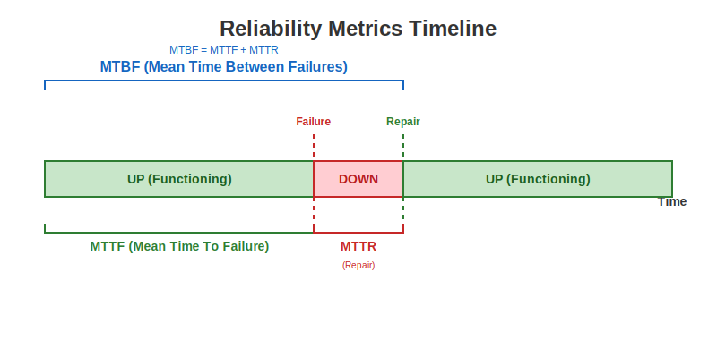

# Software Reliability Metrics 📊

To measure reliability quantitatively, software engineers use specific time-based metrics. These metrics help in planning maintenance, estimating costs, and defining Service Level Agreements (SLAs).



---

## 1. MTTF (Mean Time To Failure) 🟢
> **"How long does it run before crashing?"**

*   **Definition**: The average time a system functions correctly before a failure occurs.
*   **Focus**: Uptime / Reliability.
*   **Context**: Critical for non-repairable systems (e.g., satellites) or during the operational phase of software.

## 2. MTTR (Mean Time To Repair) 🔴
> **"How long does it take to fix?"**

*   **Definition**: The average time required to repair a failed component or system.
*   **Includes**: Detection time + Diagnosis time + Fix time + Testing time.
*   **Focus**: Maintainability / Recoverability.
*   **Goal**: Keep this as low as possible (Fast recovery).

## 3. MTBF (Mean Time Between Failures) 🔵
> **"How often does it fail?"**

*   **Definition**: The predicted elapsed time between inherent failures of a mechanical or electronic system, during normal system operation.
*   **Formula**:
    $$ \text{MTBF} = \text{MTTF} + \text{MTTR} $$
*   **Relationship**: It covers the entire cycle from "Start" -> "Fail" -> "Fix" -> "Restart".

---

## 4. Availability 📅
The probability that a system is operational at any given time.

$$ \text{Availability} = \frac{\text{MTTF}}{\text{MTTF} + \text{MTTR}} = \frac{\text{MTTF}}{\text{MTBF}} $$

*   **Example**: "99.9% Availability" (The "Three Nines").

---

## 🐍 Python Calculator

Run the calculator to compute these metrics from a list of simulated failure logs:

```bash
python metrics_calculator.py
```
