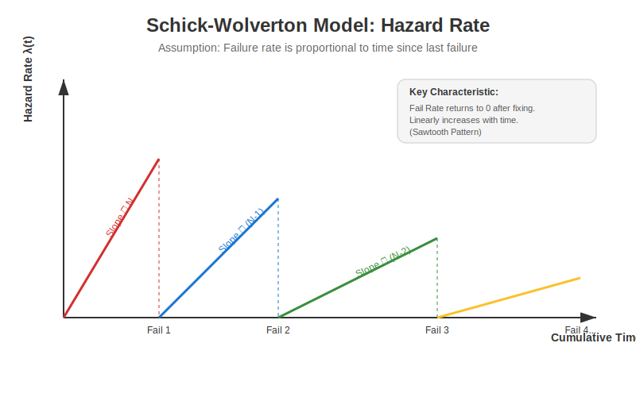

# Schick-Wolverton (S-W) Software Reliability Model 📉

The **Schick-Wolverton (S-W) Model** is a modification of the classic **Jelinski-Moranda (J-M) Model**. While J-M assumes a *constant* failure rate between failures, S-W assumes that the failure rate **increases linearly with time** within each testing interval.



---

## 🧠 Key Concept: The "Sawtooth" Effect

The core assumption is that the longer you test without finding a bug, the more likely you are to find one (because you are exploring deeper into the code, or perhaps stress is building up).

*   **J-M Model**: Hazard rate is flat ($\lambda = \phi(N - i + 1)$).
*   **S-W Model**: Hazard rate is a slope ($\lambda(t) = \phi [N - (i - 1)] t$).

Once a failure occurs and is fixed, the "Time since last failure" ($t$) resets to 0, dropping the hazard rate back to zero, creating a **Sawtooth** pattern as shown in the diagram above.

---

## 📐 Mathematical Formulation

### 1. Hazard Rate (Failure Intensity)
For the $i$-th failure interval, let $t_i$ be the time elapsed since the $(i-1)$-th failure.

$$ \lambda(t_i) = \phi [N - (i - 1)] t_i $$

Where:
*   $N$: Initial total number of faults.
*   $\phi$ (phi): Proportionality constant.
*   $i$: The current failure number ($1, 2, ... N$).

### 2. Reliability Function
The probability that no failure occurs in the interval $(0, t)$:

$$ R(t_i) = e^{-\frac{\phi [N - (i - 1)] t_i^2}{2}} $$

This curve drops faster than the exponential decay of J-M because of the $t^2$ term (Rayleigh distribution shape).

---

## 🆚 S-W Model vs J-M Model

| Feature | **Jelinski-Moranda (J-M)** | **Schick-Wolverton (S-W)** |
| :--- | :--- | :--- |
| **Failure Rate** | Constant (Flat Line) | Linear Increase (Slope) |
| **Assumption** | Random testing, purely memoryless | Influence of time since last failure |
| **Probability Dist.** | Exponential | Rayleigh-like |
| **Complexity** | Simple | Moderate |

---

## ⚖️ Advantages vs Disadvantages

| **Advantages** ✅ | **Disadvantages** ❌ |
| :--- | :--- |
| **Realistic in Testing**: Captures the intuition that "later" bugs in a session are harder to find but pressure increases. | **Complexity**: Harder to solve for parameters $N$ and $\phi$. |
| **Better Fit**: Often fits data better where failure rate isn't constant. | **Idealistic Reset**: Assumes hazard drops to EXACTLY zero after a fix, which might be too optimistic. |
| **Predictive**: Good for estimating remaining testing time. | **Data Needs**: Requires precise time-between-failure data. |

---

## 🐍 Python Simulation

Run the simulation to see how Reliability ($R(t)$) behaves under this model:

```bash
python sw_simulation.py
```
