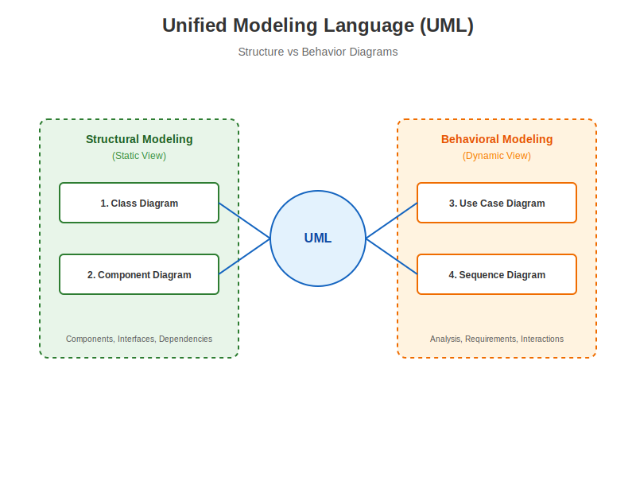
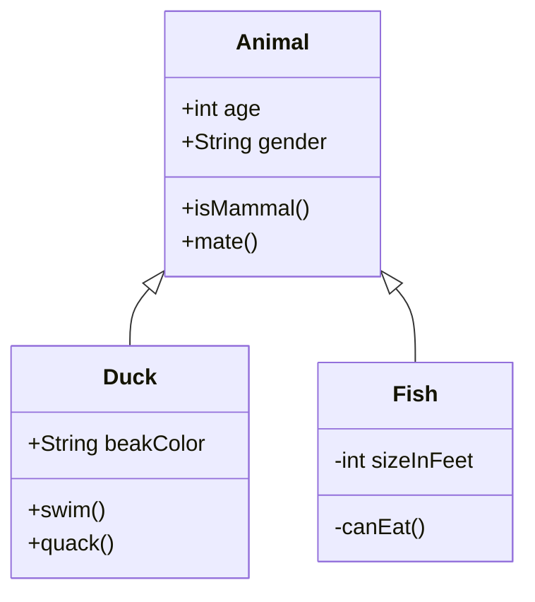
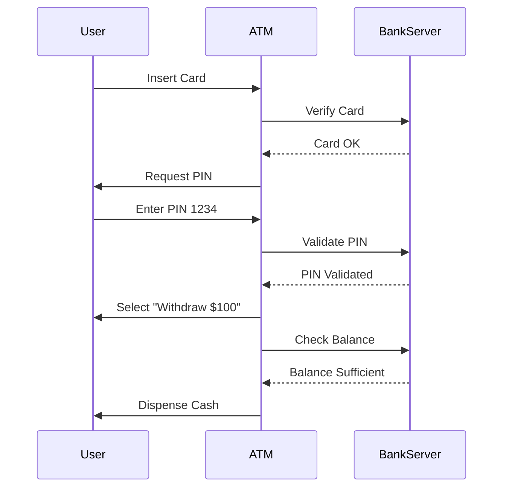
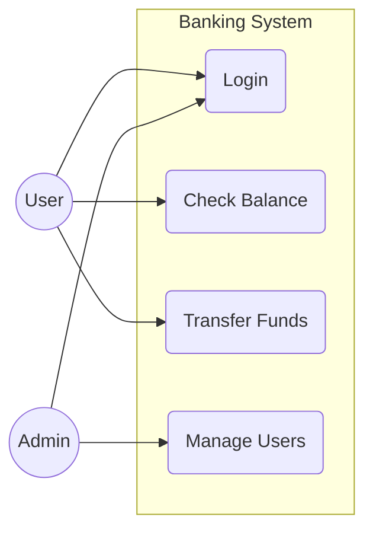
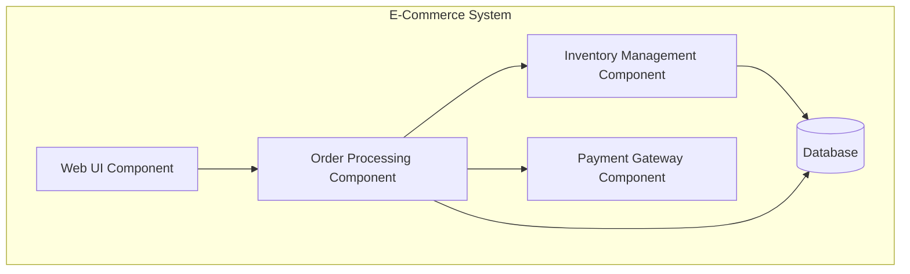

# Unified Modeling Language (UML) 📐

**UML** is the standardized general-purpose modeling language for software engineering. It provides a set of graphic notation techniques to create visual models of object-oriented software-intensive systems.



---

## Why do we need UML?

1.  **Standardization**: A universal language developers, architects, and stakeholders understand.
2.  **Visualization**: Makes complex systems easier to understand than thousands of lines of code.
3.  **Documentation**: Provides a blueprint for future maintenance.
4.  **Planning**: Allows architectural decisions to be made *before* coding begins (Blueprint vs Construction).

---

## 1. Class Diagram (Structural) 🏗️

The backbone of almost every object-oriented method. It describes the static structure of a system.

*   **Classes**: Attributes and Methods.
*   **Relationships**: Inheritance, Association, Aggregation, Composition.



---

## 2. Sequence Diagram (Behavioral) ⏱️

Shows object interactions arranged in **time sequence**. It depicts the objects involved in the scenario and the sequence of messages exchanged.

*   **Lifelines**: Vertical dashed lines representing object existence over time.
*   **Messages**: Arrows showing communication.



---

## 3. Use Case Diagram (Behavioral) 👤

Captures the dynamic behavior of a system. It models the **Actors** (users) and the **Use Cases** (functionalities).

*   **Actor**: Stick figure (User/System).
*   **Use Case**: Oval (Functionality).
*   **System Boundary**: Rectangle around use cases.



---

## 4. Component Diagram (Structural) 🧩

Depicts how components are wired together to form larger components or software systems. It illustrates the architectures of the software components and the dependencies between them.

*   **Component**: Modular part of a system.
*   **Interface**: Connection point (circle/socket).
*   **Dependency**: Dashed arrow.



---

## 🐍 Python Simulation

Run the included simulation to see how a model translates to actual object-oriented code:

```bash
python uml_code_mapping.py
```
