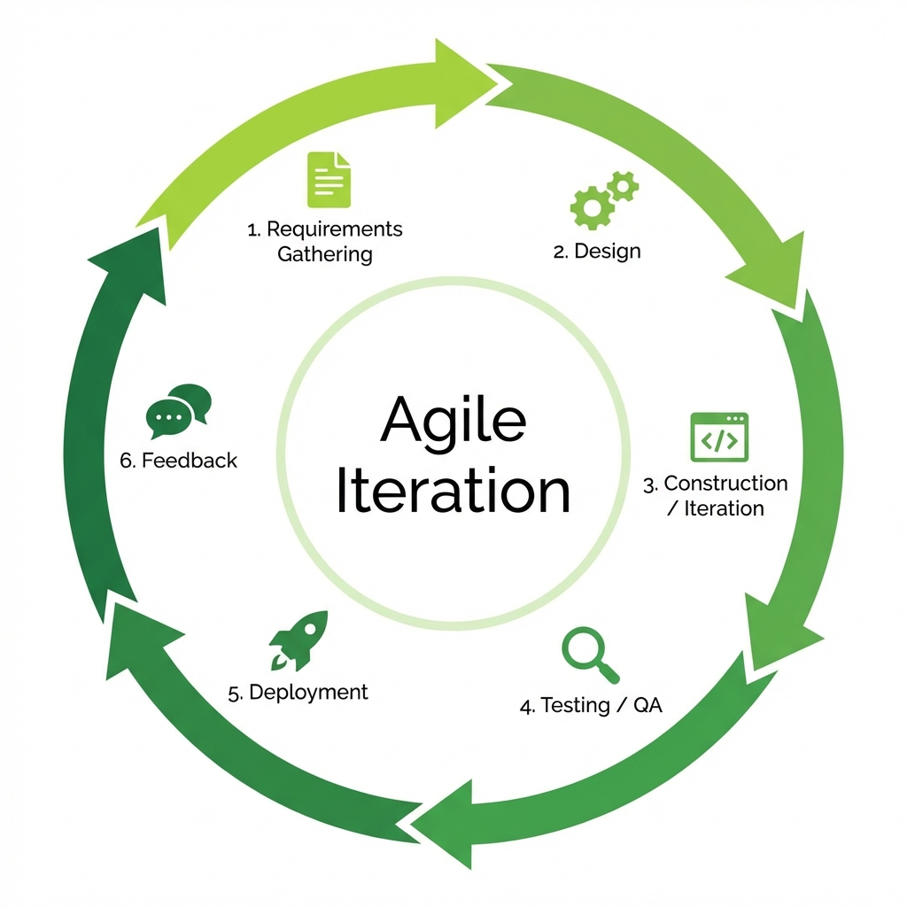

# Agile Development Model

> "Respond to Change over following a plan."

The **Agile Model** was born from the need for speed and flexibility. Unlike Waterfall, which resists change, Agile *embraces* it. It breaks development into short, repeatable cycles called **Sprints** (usually 1-4 weeks), delivering working software at the end of every single cycle.

## The Agile Cycle

1.  **Requirements Gathering**: What do we need to build *right now*?
2.  **Design**: Quick wireframes/architecture for just these features.
3.  **Construction**: Developing the features (Sprint).
4.  **Testing**: Verification of the new code.
5.  **Deployment**: Releasing the update to users.
6.  **Feedback**: Asking users, "Do you like this?" -> Use answers for the next cycle.



## Agile SDLC Methodologies
Agile is a "umbrella" term for several frameworks. Common ones include:
1.  **Scrum**: Focuses on management (Sprints, Standups, Roles like Scrum Master).
2.  **Kanban**: Visualizes work-in-progress (Post-it notes) to reduce bottlenecks.
3.  **XP (Extreme Programming)**: Focuses on technical quality (Pair Programming, Code Reviews).
4.  **TDD (Test-Driven Development)**: Write the test *before* the code. Fails safely, then passes.
5.  **BDD (Behavior-Driven Development)**: Write tests in plain English (e.g., "Given... When... Then...").
6.  **ATDD (Acceptance Test-Driven Development)**: Collaborative testing requirements before coding.

## Core Principles (The Agile Manifesto)
*   **Satisfy the Customer**: Early and continuous delivery of valuable software.
*   **Welcome Change**: Even late in development.
*   **Deliver Frequently**: Weeks rather than months.
*   **Face-to-Face**: The most efficient way to communicate (Daily Standups).
*   **Simplicity**: Maximizing the work *not* done is essential.

---

## Real-Life Example: Mobile App Startup (e.g., Use-Uber-Clone)

*   **The Context**: You are building a new ride-sharing app. You don't know if people want luxury cars or cheap scooters.
*   **Why Agile?**: You cannot plan everything because the market changes every week. You need to test assumptions fast.
*   **The Execution**:
    *   **Sprint 1 (2 Weeks)**: Build a button that calls a taxi. **Deploy**.
    *   **Feedback**: Users say "We want to see the price first."
    *   **Sprint 2 (2 Weeks)**: Add Price Estimation. **Deploy**.
    *   **Feedback**: Users say "Drivers are getting lost."
    *   **Sprint 3 (2 Weeks)**: Add GPS Tracking. **Deploy**.
    
    *Result: You built exactly what users wanted, step-by-step.*

---

## Advantages vs Disadvantages

| Pros | Cons |
| :--- | :--- |
| **Adaptability**: Changes are welcome at any stage. | **Documentation**: Often neglected ("Code is the documentation"). |
| **Customer Satisfaction**: Users see progress every 2 weeks. | **Scope Creep**: Without a strict plan, the project can go on forever. |
| **Quality**: Continuous testing finds bugs early. | **Expertise**: Requires highly skilled, self-organizing teams. |

---

## Simulation

The Python simulation below demonstrates a **Sprint**. You will clear tasks from the "Product Backlog", develop them, and get randomized "User Feedback" that influences the next sprint!

```bash
python agile_simulation.py
```
