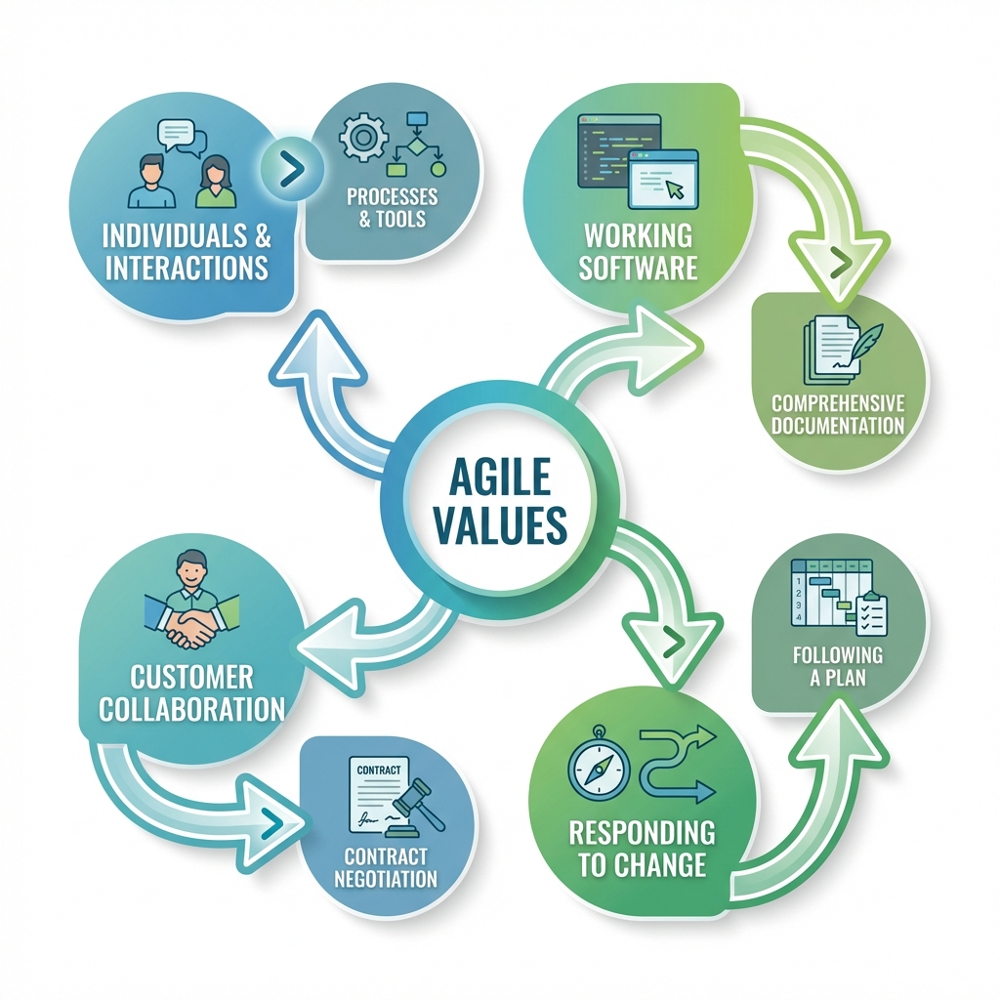

# Agile Software Development

> "Individuals and interactions over processes and tools."

Agile Software Development is a methodology that values **flexibility, collaboration, and customer satisfaction**. Instead of a rigid plan, it focuses on iterative progress.

It is based on the **Agile Manifesto**, primarily designed to help a project adapt quickly to change requests.

## The 4 Core Values
1.  **Individuals and Interactions** > Processes and Tools.
2.  **Working Software** > Comprehensive Documentation.
3.  **Customer Collaboration** > Contract Negotiation.
4.  **Responding to Change** > Following a Plan.



---

## 6-Step Agile Process
Agile is not chaos; it has a structured cycle:

1.  **Requirements Gathering**: Discuss with the customer. Prioritize the "Must Haves".
2.  **Planning**: Create a roadmap for the iteration (Sprint).
3.  **Development**: Build small, usable pieces of the product.
4.  **Testing**: Verify functionality immediately.
5.  **Deployment**: Release the iteration to users.
6.  **Maintenance/Feedback**: Gather input and refine.

---

## Real-Life Example: The Web Browser Race (Team A vs Team B)

*   **Scenario**: Company ABC wants a new web browser in 10 months.
*   **Team A (Waterfall) Plan**:
    *   1.5 Months gathering requirements.
    *   2 Months designing.
    *   4 Months coding.
    *   **Result**: When the CEO asks for a "Crypto Wallet Feature" in month 4, Team A is stuck. They can't go back without restarting.
*   **Team B (Agile) Plan**:
    *   2-Week Iterations.
    *   Month 1: Basic Browser released.
    *   Month 2: Bookmarks added.
    *   **Result**: When the CEO asks for the "Crypto Wallet" in month 4, Team B just adds it to the **Next Sprint**. No time lost.

---

## 12 Principles of Agile
1.  **Satisfy the Customer** through early delivery.
2.  **Welcome Changing Requirements**, even late in development.
3.  **Deliver Frequent Updates** (weeks, not months).
4.  **Business & Developers Work Together** daily.
5.  **Trust Motivated Individuals** to get the job done.
6.  **Face-to-Face Conversation** is best.
7.  **Working Software** is the primary measure of progress.
8.  **Sustainable Development**: Maintain a constant pace.
9.  **Technical Excellence** enhances agility.
10. **Simplicity** (maximizing work not done) is essential.
11. **Self-Organizing Teams** create the best architectures.
12. **Regular Reflection** (Retrospectives) to tune behavior.

## Pros & Cons

| Advantages | Disadvantages |
| :--- | :--- |
| **High Customer Satisfaction** (They see results). | **Less Predictable** (Hard to know exact end date). |
| **Adapts to Change** (Market shifts? No problem). | **Scope Creep** (Projects can expand forever). |
| **Better Quality** (Constant testing). | **Documentation Rot** (Docs are often ignored). |

---

## Simulation: Waterfall vs Agile Race

Run the simulation below to see **Team A (Waterfall)** vs **Team B (Agile)** competing to build a product when unexpected changes occur!

```bash
python waterfall_vs_agile_race.py
```
