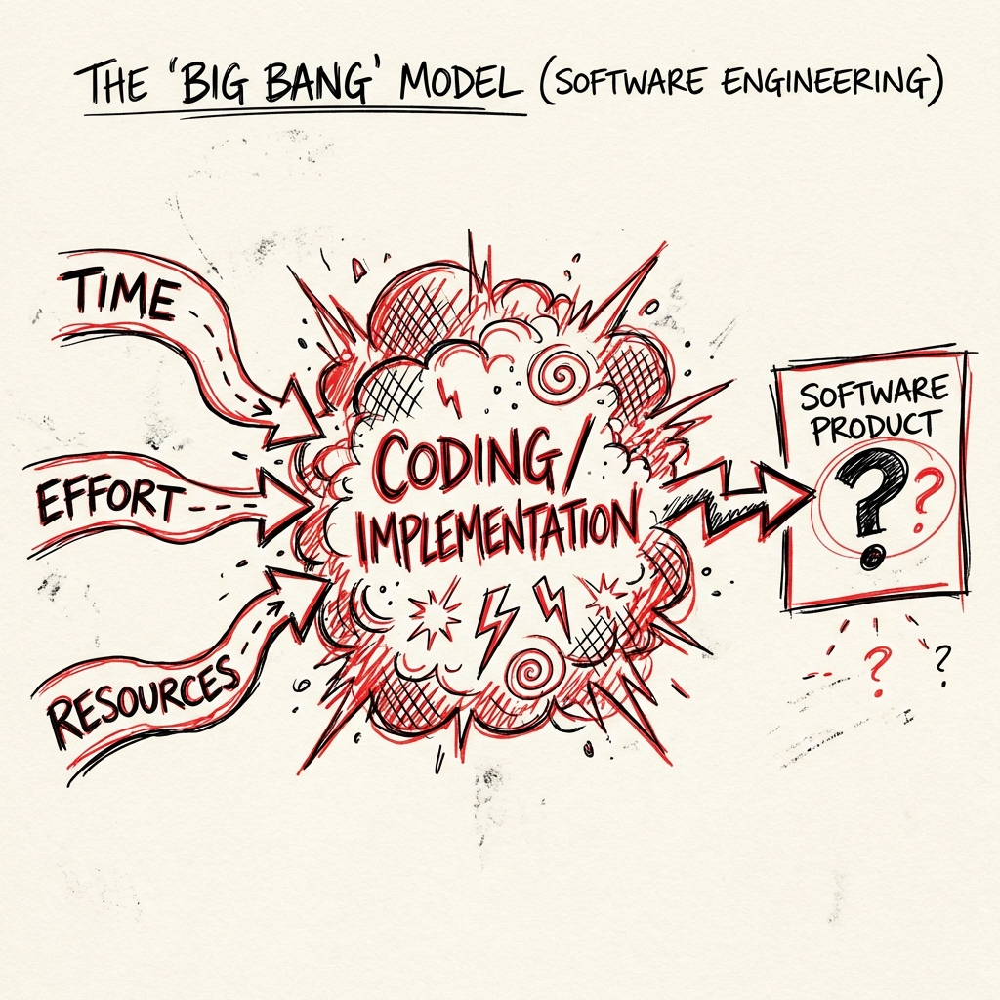

# Big Bang Model

> "Just start coding!"

The **Big Bang Model** is the simplest and most high-risk model. It requires **no planning, no documentation, and no process**. All time and effort are poured directly into coding.

## The "Process"
1.  **Inputs**: Time, Money, Energy.
2.  **Implementation**: Chaotic coding.
3.  **Output**: A product that *might* work... or might fail completely.



## Why use it?
It sounds terrible, but it's useful for:
*   **Learning**: A student practicing a new language.
*   **Hackathons**: 24-hour coding competitions.
*   **Tiny Projects**: A script to rename 100 files.

## Real-Life Example: The 24-Hour Hackathon
*   **Scenario**: A team of 3 students wants to win a Hackathon. The theme is "Save the Ocean".
*   **Process**:
    *   **Hour 1**: "Let's make a plastic-eating robot!"
    *   **Hour 2**: Developer A starts coding the movement. Developer B starts coding the sensors. No API was defined.
    *   **Hour 12**: They realize Developer A used Python and Developer B used C++. They can't talk to each other.
    *   **Hour 20**: They throw away the sensors and just make the robot spin in circles.
    *   **Hour 24**: The demo works! (But the code is garbage and will never be used again).

## Pros & Cons

| Advantages | Disadvantages |
| :--- | :--- |
| **Zero Planning Time**: Start coding immediately. | **High Risk**: High chance of total failure. |
| **Simple**: No management overhead. | **Spaghetti Code**: Unmaintainable messy code. |
| **Good for Learning**: Great for prototypes/practice. | **Not Scalable**: Terrible for teams > 2 people. |

---

## Simulation: The Coin Toss

Run the simulation to see if your "Big Bang" project succeeds or fails. Since there is no planning, it creates a random outcome every time!

```bash
python big_bang_simulation.py
```
