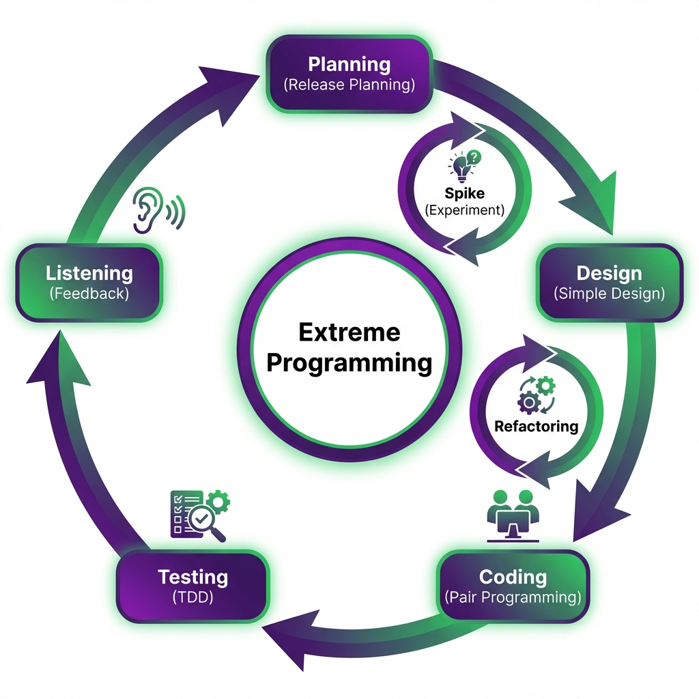

# Extreme Programming (XP)

> "Take best practices to the extreme."

Extreme Programming (XP) is an Agile framework that aims to produce higher quality software and higher quality of life for the development team. It is the most "technical" of the Agile frameworks, prescribing specific code-level practices.



## The 5 Core Values
XP is driven by values. If you aren't doing these, you aren't doing XP.
1.  **Communication**: Everyone talks constantly. No hidden knowledge.
2.  **Simplicity**: "What remains is essential." Build only what is needed *today*.
3.  **Feedback**: Unit tests give instant feedback. Users give daily feedback.
4.  **Courage**: Refactor code fearlessly. Throw away bad code.
5.  **Respect**: No individual ownership of code. We all fix everyone's bugs.

---

## Key Practices (The "Extreme" Part)

| Practice | Description |
| :--- | :--- |
| **Pair Programming** | Two devs, one computer. One types (Driver), one reviews (Navigator). Switches every hour. |
| **TDD (Test-Driven Development)** | Write the test **before** the code. Red -> Green -> Refactor. |
| **Continuous Integration** | Committing code meant times a day. No "Integration Hell" at the end. |
| **Refactoring** | Restructuring code without changing behavior. Kepping it clean. |
| **On-Site Customer** | A real customer sits with the team to answer questions instantly. |

---

## The XP Life Cycle
1.  **Planning (The Planning Game)**: Customers define "User Stories". Team estimates effort.
2.  **Design**: Keep it simple. Use CRC cards.
3.  **Coding**: Pair programming. Write unit tests first.
4.  **Testing**: Run all automated tests. Acceptance tests by customer.
5.  **Listening**: Get feedback. Repeat.

---

## Real-Life Example: High-Frequency Stock Trading System

*   **The Context**: A financial firm needs a trading bot. A bug could lose millions in seconds. Speed and reliability are paramount.
*   **Why XP?**:
    *   **TDD ensures safety**: Every single trading rule (e.g., "Don't buy if risk > 5%") is a test case. The system literally cannot be built unless it passes these safety checks first.
    *   **Pair Programming**: Complex algorithms are written by two brains. One person spots the logic error that the other missed.
    *   **Courage**: As the market changes, developers continually "Refactor" the core engine to be faster, without fear of breaking it (because they have thousands of tests).

---

## Simulation: TDD & Pair Programming

Run the simulation below to experience a **Test-Driven Development** session with a virtual pair programmer!

```bash
python xp_simulation.py
```
