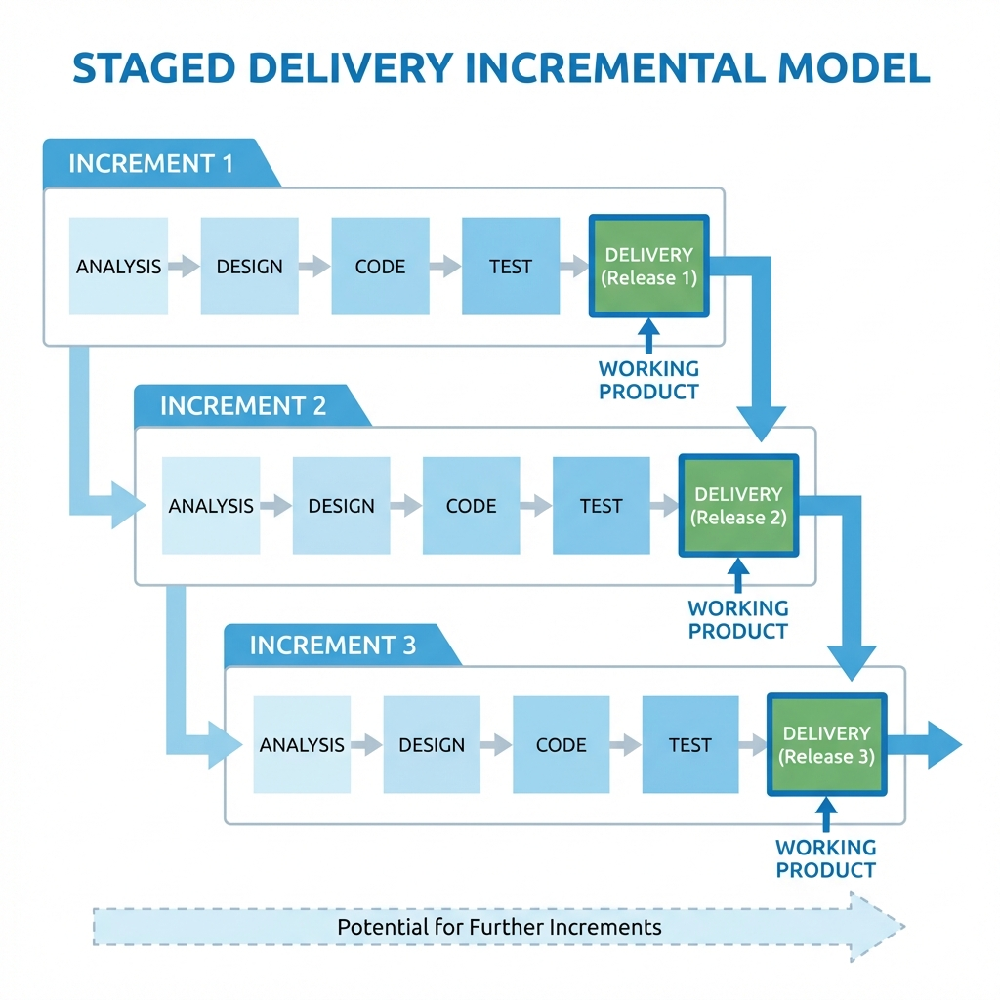
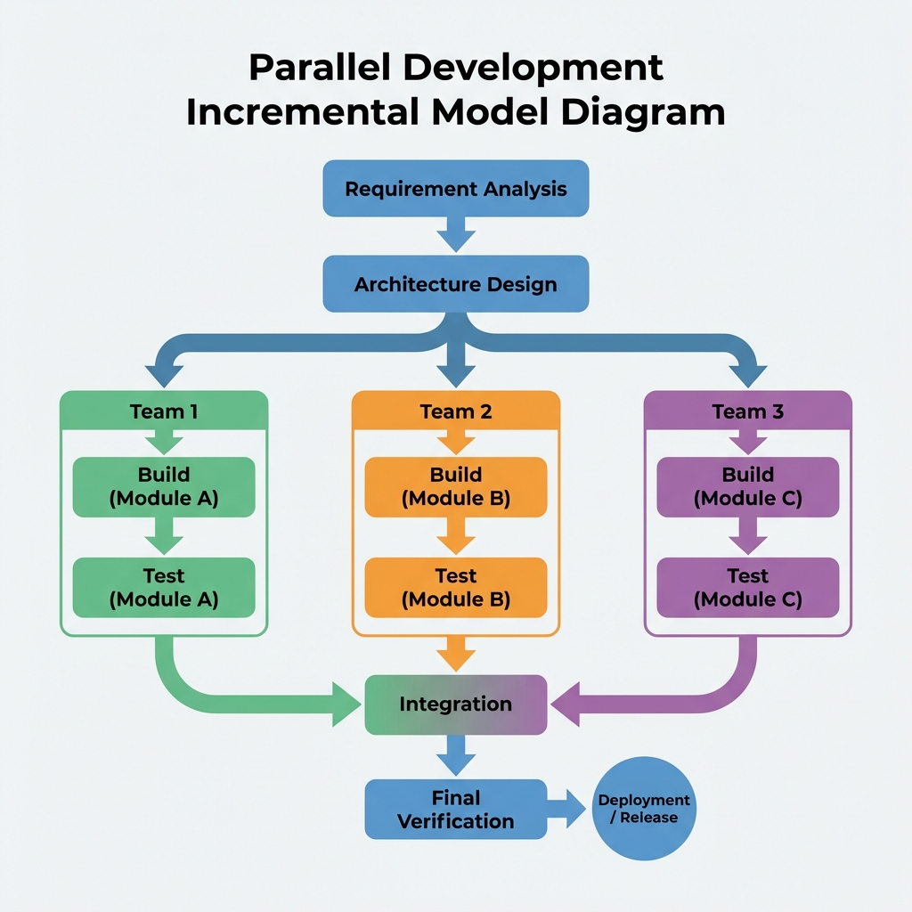

# Incremental Process Model

> "Think big, act small, move fast."

The **Incremental Process Model** breaks down the software development into small, manageable chunks called **increments**. Instead of delivering a massive "Big Bang" release at the end of months of work, you deliver a **working product** feature-by-feature.

Every new increment adds functionality to the previous one, until the final system is complete.

## Core Phases (Repeated per Increment)
1.  **Requirement Analysis**: Define what specifically goes into *this* increment.
2.  **Design & Development**: Build the new features.
3.  **Testing**: Verify the new features AND ensure they don't break old ones (Regression Testing).
4.  **Implementation**: Deploy the working increment to the user.

---

## Types of Incremental Models

### 1. Staged Delivery Model
**"One step at a time."**
You build and release one part of the system at a time in a linear sequence.
*   **Best for**: When you specifically want to get Feature A to the customer before starting on Feature B.
*   **Visual**:


### 2. Parallel Development Model
**"Divide and Conquer."**
Different teams work on different components simultaneously (in parallel) to speed up development. They merge everything at the end.
*   **Best for**: Short deadlines where you have enough staff to double-track work.
*   **Visual**:


---

## Expert Analysis: When to Use?

| Scenario | Recommendation |
| :--- | :--- |
| **Urgent Basic Needs** | **YES**. Use this to ship the "Core" features immediately (Increment 1) while perfecting the "Nice-to-haves" later. |
| **High Staff Logic** | **YES**. Parallel development allows you to utilize a large workforce efficiently. |
| **Unclear Future** | **YES**. If you know the core requirements but not the details of the add-ons, this is perfect. |
| **Tight Integration** | **NO**. If the system is a monolith where every part depends on every other part, breaking it up might cause integration nightmares. |

## Pros & Cons

| Advantages | Disadvantages |
| :--- | :--- |
| **Early Value**: Customer gets software *fast*. | **Integration Hell**: Merging increments can be messy. |
| **Flexibility**: Can change direction between increments. | **Architecture Rot**: Adding pieces piecemeal can degrade system design if not careful. |
| **Cash Flow**: Useful if client pays per milestone. | **Cost**: Repeated testing (Regression) adds up. |

---


---

## Real-Life Example: Word Processor (e.g., MS Word 1.0)

*   **The Context**: You want to release a competitor to an existing typewriter software. Speed to market is key.
*   **Why Incremental?**: You don't need "Clip Art" to launch. You just need to let people type.
*   **The Execution (Staged Delivery)**:
    *   **Increment 1**: Basic Typing, Saving, Printing. **RELEASED TO MARKET.** (Users can start writing).
    *   **Increment 2**: Spell Check & Fonts. (Delivered as an update 3 months later).
    *   **Increment 3**: Tables & Graphics. (Delivered 6 months later).

---

## Simulation

The Python simulation below demonstrates the **Staged Delivery** approach. It builds a "User Management System" in 3 distinct increments, showing how the product grows over time.

```bash
python incremental_simulation.py
```
