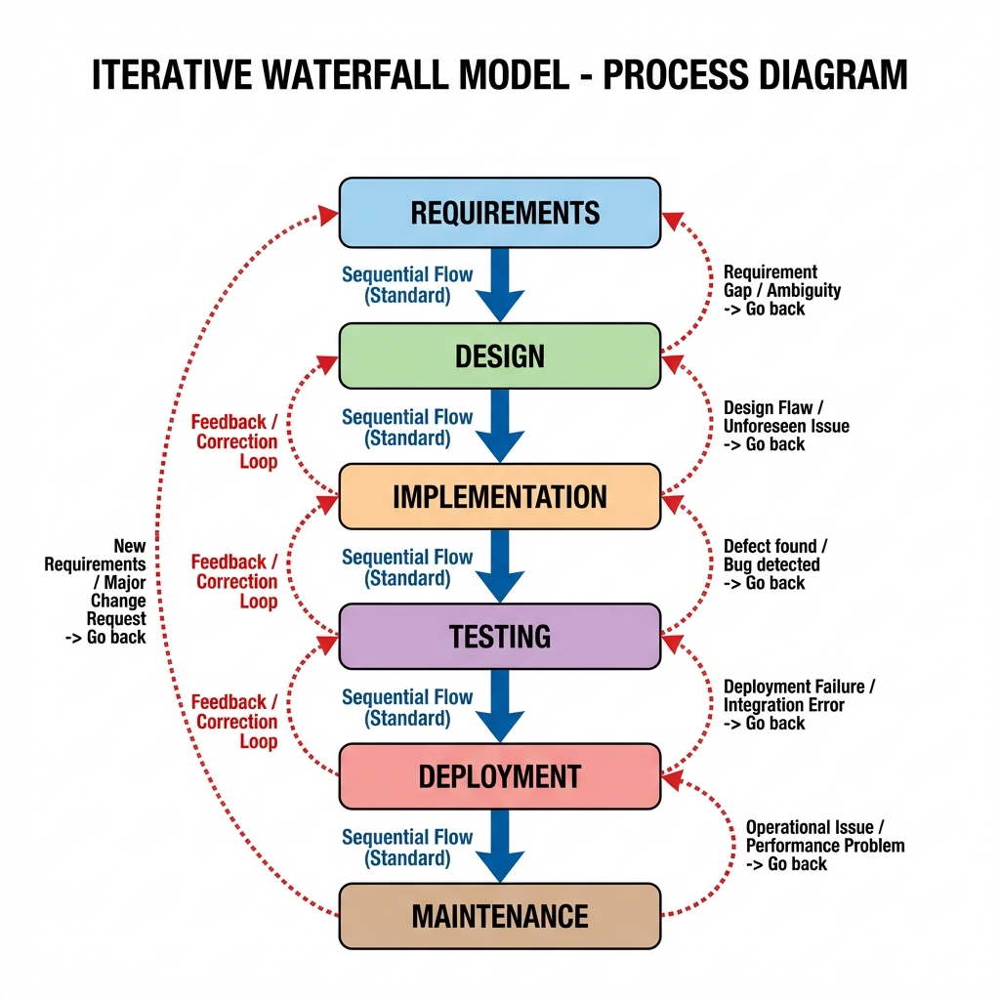

# Iterative Waterfall Model

> "Evolutionary perfection through feedback."

The **Iterative Waterfall Model** evolved to address the primary rigidity of the Classical Waterfall Model. While it retains the phase-by-phase structure, it acknowledges a fundamental reality of software engineering: **errors happen, and requirements evolve.**

This model introduces **Feedback Paths**, allowing phases to communicate backwards. If a deficiency is found in the Testing phase, the process can revert to Design or even Requirements to correct the issue properly.



## Core Concept: The Feedback Loop
Unlike the "blocked" nature of the classical model, here:
1.  **Sequential Flow**: You still move from Requirements -> Design -> Implementation.
2.  **Iterative Correction**: If an error is detected in *Implementation*, you don't just "patch" it. You go back to *Design*, update the blueprint, and *then* re-implement.

## Phases & Feedback

### 1. Requirements Gathering
*   **Goal**: Define functional and non-functional needs.
*   **Feedback**: If design analysis reveals a requirement is impossible, control flows back here to renegotiate scope.

### 2. Design
*   **Goal**: Create system architecture (HLD/LLD).
*   **Feedback**: If complexity during coding is too high, developers send feedback here to simplify the design.

### 3. Implementation (Coding)
*   **Goal**: Build the software.
*   **Feedback**: If testing reveals bugs caused by poor logic, the process iterates back to coding (or design) to fix the root cause.

### 4. Testing
*   **Goal**: Validation against SRS.
*   **Feedback**: The critical filter. Major bugs trigger a return to previous phases.

### 5. Deployment & Maintenance
*   **Goal**: Live release.
*   **Feedback**: User feedback becomes the requirements for the next iteration (maintenance cycle).

---

## Why Use It? (Expert Analysis)

The Iterative Waterfall is the "Real World" Waterfall. Pure classical waterfall almost never exists because humans make mistakes.

| Feature | Classical Waterfall | Iterative Waterfall |
| :--- | :--- | :--- |
| **Error Cost** | High (Fixes are "hacks" if phase is closed) | Lower (Formal path to fix root cause) |
| **Flexibility** | Rigid | Moderate (Allows backtracking) |
| **Risk** | High (Big Bang testing at end) | Medium (Progressive validation) |

## Advantages & Disadvantages

### ✅ Advantages
*   **Early Error Detection**: Feedback paths catch design flaws before deployment.
*   **Better Quality**: Systematic rework produces cleaner code than "patching".
*   **Project Control**: Still maintains the strict milestones of Waterfall, which managers love.

### ❌ Disadvantages
*   **Resource Intensive**: Going back costs time and money.
*   **Scope Creep**: "Feedback" can sometimes turn into "let's add new features," delaying the project.
*   **Not fully Agile**: It is still a heavy, document-driven process compared to Scrum/Kanban.

---

## Simulation

The standard Waterfall simulation flows one way. The Iterative simulation below introduces **randomized "defects"** that force the project to go back a step!

```bash
python iterative_simulation.py
```
