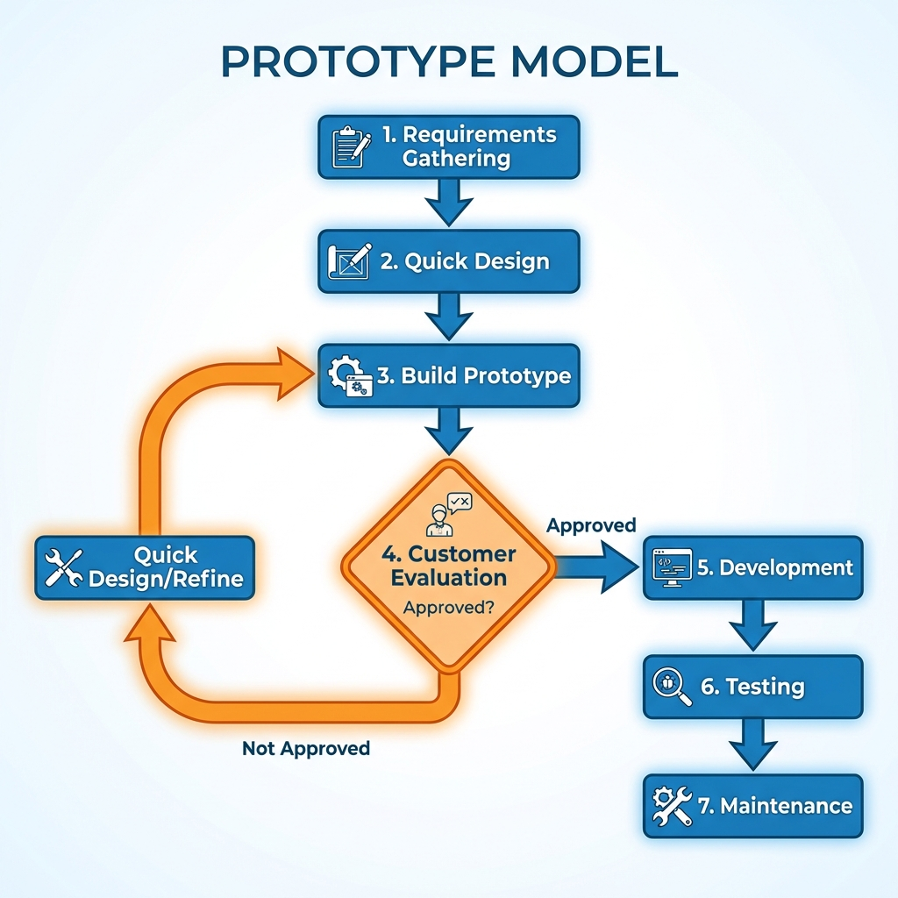

# Prototype Model

> "I'll know it when I see it."

The **Prototype Model** is used when requirements are unclear or the customer isn't sure what they want. Instead of building the full product immediately, a **working replica (mock-up)** is built first.

The customer plays with the prototype, gives feedback, and the prototype is refined. This cycle repeats until the customer says, "Yes, this is exactly what I want!" only then does the *real* development begin.

## The Process
1.  **Requirements Gathering**: Basic needs (not detailed).
2.  **Quick Design**: Focus on the User Interface (Input/Output).
3.  **Build Prototype**: A dummy version (may not have working logic).
4.  **Customer Evaluation**: The user "test drives" it.
5.  **Refinement**: Fix what the user didn't like. *Loop back to step 3.*
6.  **Implementation**: Once approved, build the final robust system.



## Types of Prototyping
1.  **Throwaway/Rapid Prototyping**: Build it quick, learn from it, then throw it away and write clean code from scratch.
2.  **Evolutionary Prototyping**: Start with a core working model and keep adding to it until it becomes the final product.
3.  **Incremental Prototyping**: Build separate prototypes for different features and merge them later.
4.  **Extreme Prototyping**: Used in web dev (Static HTML -> Data Layer -> Services).

---

## Real-Life Example: Designing a New Toy Action Figure

*   **The Problem**: A toy company wants to make a new "Space Hero" figure, but isn't sure if kids will like the design.
*   **The Waterfall Way**: spend 6 months making expensive steel molds. If kids hate it, you lose $100k.
*   **The Prototype Way**:
    1.  **Sketch**: Artist draws a quick concept.
    2.  **Clay Model (Prototype 1)**: Sculptor makes a rough clay version in 2 days.
    3.  **Feedback**: Kids say "He looks too scary!"
    4.  **3D Print (Prototype 2)**: Design is adjusted to be friendlier and 3D printed in plastic.
    5.  **Feedback**: Kids say "Cool! But his sword is too small."
    6.  **Final Model (Prototype 3)**: Sword size increased. Kids love it.
    7.  **Manufacturing**: *Now* you spend money on the expensive steel molds, knowing it will sell.

---

## Pros & Cons

| Advantages | Disadvantages |
| :--- | :--- |
| **Clarity**: Users see what they are getting. | **False Expectations**: Users might think the "dummy" is the "final" product. |
| **Early Feedback**: Changes are cheap to make. | **Spaghetti Code**: Developers might try to patch the "quick" code instead of rewriting it properly. |
| **Risk Reduction**: Fewer surprises at launch. | **Cost**: Building 3 versions costs more than building 1 (if you get it right the first time). |

---

## Simulation: The Feedback Loop

Run the simulation to play the role of a Developer showing a prototype to a picky Client.

```bash
python prototype_simulation.py
```
