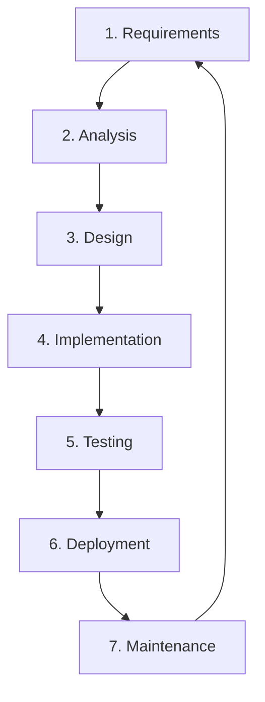

# Software Development Life Cycle (SDLC)

> "Failing to plan is planning to fail." - Benjamin Franklin

## What is SDLC?
The **Software Development Life Cycle (SDLC)** is a structured process used by the software industry to design, develop, and test high-quality software. The SDLC aims to produce high-quality software that meets or exceeds customer expectations, reaches completion within times and cost estimates.

It is arguably the most important concept in Software Engineering. Without it, development is chaotic and unpredictable (like the [Big Bang Model](./Big%20Bang%20Model/README.md)).

## Why is SDLC Important?
1.  **Standardization**: Every developer speaks the same language.
2.  **Project Control**: Managers can track progress against specific milestones (e.g., "The Design Phase is complete").
3.  **Predictability**: Helps estimate cost, time, and resources.
4.  **Quality**: Testing is embedded in the process, not just an afterthought.
5.  **Documentation**: Ensures knowledge doesn't leave with the developer.

## The 7 Stages of SDLC

| Stage | Description | Key Artifact |
| :--- | :--- | :--- |
| **1. Requirements** | gathering what the client wants. "What are we building?" | **SRS** (Software Requirement Specification) |
| **2. Analysis** | Feasibility study. "Can we build it? Is it profitable?" | Feasibility Report |
| **3. Design** | Planning the architecture, UI, and DB. "How will we build it?" | **DDS** (Design Document Specification) |
| **4. Implementation** | The actual coding. Transforming design into logic. | Source Code |
| **5. Testing** | Verifying if the code works as expected (Unit, Integration, System). | Test Reports |
| **6. Deployment** | Releasing the software to users (Beta, Prod). | Live Application |
| **7. Maintenance** | Fixing bugs, updates, and support after release. | Patch / Update |

## Models of SDLC
There isn't one single "SDLC Model". Different projects require different approaches.
*   **Sequential**: [Waterfall](./Waterfall%20Model/README.md), [V-Model](./SDLC%20V-Model/README.md)
*   **Iterative**: [Spiral](./Spiral%20Model/README.md), [Incremental](./Incremental%20Process%20Model/README.md)
*   **Evolutionary**: [Prototyping](./Prototype%20Model/README.md)
*   **Agile**: [Scrum](./Scrum%20Model/README.md), [XP](./Extreme%20Programming/README.md), [RAD](./Rapid%20Application%20Development%20Model/README.md)
*   **Chaotic**: [Big Bang](./Big%20Bang%20Model/README.md)

See the detailed **[Comparison of Models](./Comparison%20of%20Models/README.md)** guide to choose the right one.
