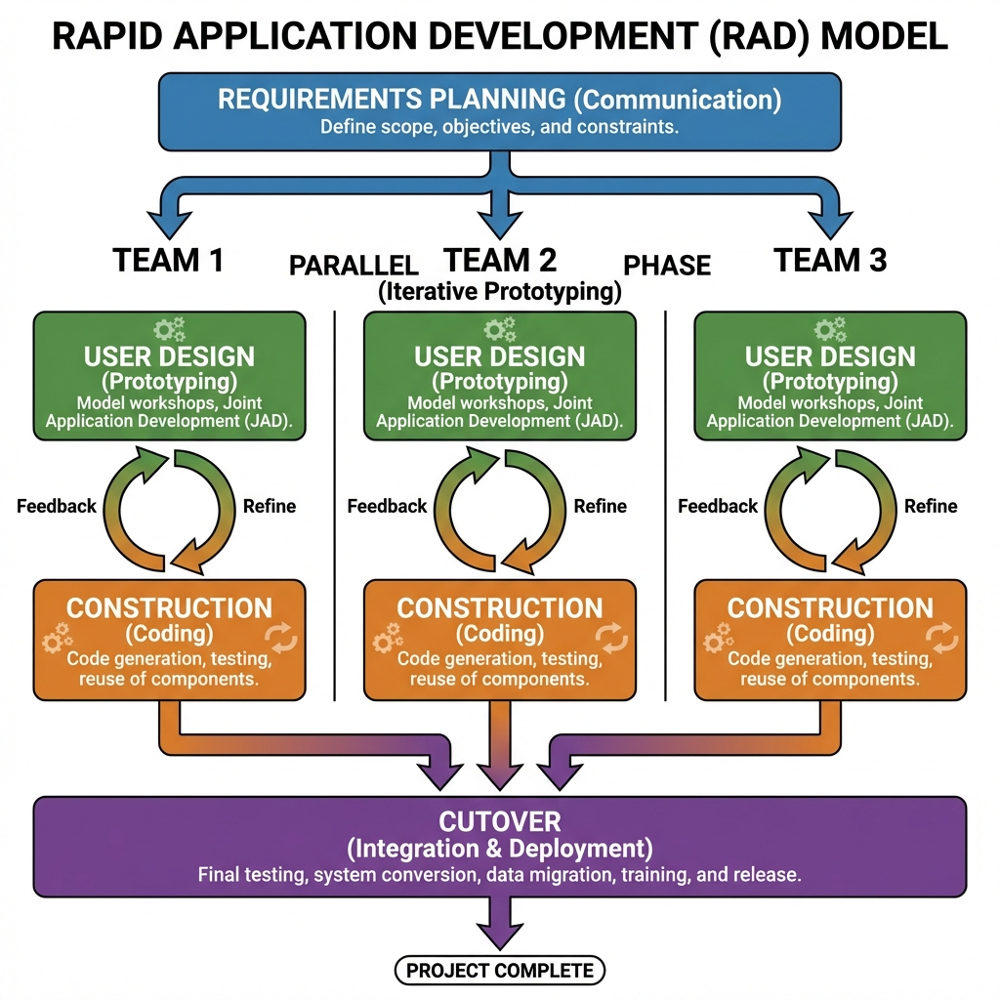

# Rapid Application Development (RAD) Model

> "Need for Speed."

The **Rapid Application Development (RAD)** model is a high-speed adaptation of the linear sequential model in which rapid development is achieved by using a component-based construction approach. If requirements are well understood and the project scope is constrained, the RAD process enables a development team to create a "fully functional system" within very short time periods (e.g., 60 to 90 days).

## The 4 Phases of RAD

### 1. Requirements Planning
*   Users and developers meet to identify objectives.
*   Focus is on broad scope, not details.
*   **Result**: A rough project plan.

### 2. User Design (The "Feedback Loop")
*   This is a continuous interactive process relative to traditional models.
*   Users participate directly.
*   Prototypes are built, tested by users, and refined.
*   **Goal**: Ensure the system does what the user *actually* wants, not just what they *said* they wanted.

### 3. Construction
*   Parallel development teams work on different modules.
*   Heavily relies on **Automated Code Generation** and **Reusable Components**.
*   Since the user has already seen the prototype, integration is smoother.

### 4. Cutover
*   The final switch.
*   Includes data migration, final testing, and training.
*   Because components were tested independently during construction, this phase is relatively fast.

---

## When to Use? (Expert Opinion)

| Scenario | Recommendation |
| :--- | :--- |
| **Short Deadline (2-3 months)** | **YES**. RAD is designed for speed. |
| **Budget is Flexible** | **YES**. Automated tools and experts cost money. |
| **User Availability** | **CRITICAL**. If the user cannot meeting weekly for feedback, RAD will fail. |
| **Legacy Systems** | **NO**. If the system cannot be modularized, RAD is impossible. |

## Advantages vs Disadvantages

| Pros | Cons |
| :--- | :--- |
| **Speed**: Drastically reduces development time. | **Cost**: Requires expensive tools and highly skilled engineers. |
| **User Satisfaction**: Constant feedback loop means no "surprises" at the end. | **Commitment**: Requires strong user commitment throughout the lifecycle. |
| **Simplicity**: Reusable components reduce complexity. | **Technical Risk**: Not suitable for high-tech risk where new technology is unproven. |

---

## Simulation

The simulation below demonstrates the **Time-Boxing** and **Parallelism** of RAD. Several teams work simultaneously to hit a strict 60-day deadline.

---

## RAD vs. Parallel Development (Incremental Model)

Both models use **Parallelism** (multiple teams working at once), but their philosophy is different.

| Feature | RAD Model | Parallel Development (Incremental) |
| :--- | :--- | :--- |
| **Primary Goal** | **Speed** & User Feedback. | **Throughput**. Getting more work done. |
| **Time Constraint** | **Strict Time-Boxing** (60-90 days). If a feature isn't ready, it's cut. | **Milestone Based**. We release when the module is ready. |
| **User Involvement** | **High**. Users test prototypes constantly. | **Moderate**. Users get the finished module at the end. |
| **Flexibility** | **High**. "Change the design now!" | **Low**. Requirements are usually fixed per module. |

### Real-World Examples

#### 1. RAD Example: "Black Friday Sale App"
*   **The Context**: A retailer needs a mobile app specifically for a Black Friday sale.
*   **Why RAD?**: The deadline is **immovable**. The sale starts on Friday.
*   **Execution**:
    *   Team A does the Product Feed.
    *   Team B does the Payment Gateway.
    *   User (Marketing Manager) reviews the UI every 3 days.
    *   **Result**: The app launches in 60 days. It might be buggy, but it's *on time*.

#### 2. Parallel Incremental Example: "Building a New Operating System"
*   **The Context**: Microsoft building Windows 12.
*   **Why Parallel?**: It's too big for one team, but there's no "60-day" hard stop.
*   **Execution**:
    *   Team A works on the File System (NTFS).
    *   Team B works on the UI (Start Menu).
    *   Team C works on Networking.
    *   **Result**: They merge their work after 2 years. If the UI Team is late, the whole release waits. They don't just "cut" the Start Menu to ship on time.

