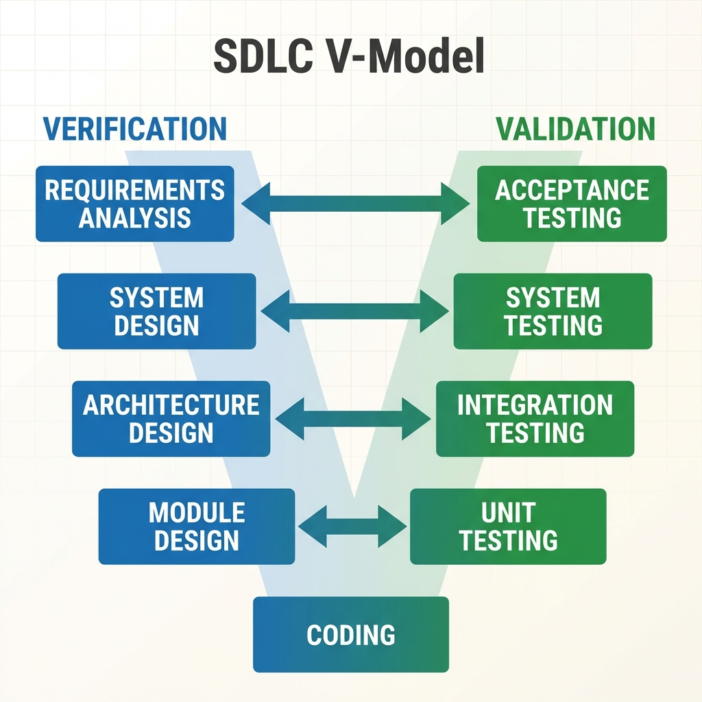

# SDLC V-Model

> "Verification and Validation go hand-in-hand."

The **V-Model** is an extension of the Waterfall model. Instead of moving purely downwards, the process bends upwards after coding. The letter "V" illustrates that **for every development phase, there is a corresponding testing phase**.

This ensures that testing is not an afterthought but is planned parallel to development.

## The V-Shape Structure

*   **Left Side (Verification)**: Building the product right (Requirements -> Design -> Coding).
*   **Bottom (Implementation)**: Writing the code.
*   **Right Side (Validation)**: Building the right product (Unit Testing -> Integration -> System -> Acceptance).



## The Phases

### 1. Verification (The Downward Slope)
*   **Requirements Analysis**: Determining what needs to be built.
    *   *Corresponding Test*: **User Acceptance Test (UAT)** Plan is created here.
*   **System Design**: Designing the full system.
    *   *Corresponding Test*: **System Test** Plan is created here.
*   **Architecture Design**: High-level design (Modules/APIs).
    *   *Corresponding Test*: **Integration Test** Plan is created here.
*   **Module Design**: Detailed logic for each function.
    *   *Corresponding Test*: **Unit Test** Plan is created here.

### 2. Implementation (The Point of the V)
*   **Coding**: Writing the actual source code based on the detailed design.

### 3. Validation (The Upward Slope)
*   **Unit Testing**: Testing individual functions/classes.
*   **Integration Testing**: Testing communication between modules.
*   **System Testing**: Testing the full application.
*   **User Acceptance Testing (UAT)**: Final verification by the client in a real-world environment.

---

## Real-Life Example: Airbag Control System (Safety-Critical)

*   **Why V-Model?**: In a car airbag system, you cannot "fix bugs later". It must work the first time. The V-Model verifies every single requirement *before* a single line of code is written.
*   **Process**:
    1.  **Requirement**: "Airbag must deploy within 20ms of impact." -> **UAT Plan**: "Simulate impact and measure timer."
    2.  **System Design**: "Sensor A sends signal to Controller B." -> **System Test Plan**: "Verify signal integrity between A and B."
    3.  **Code**: Write the C++ code for the controller.
    4.  **Validation**: Execute the tests planned in steps 1 & 2. If the 20ms timer fails, development halts immediately.

---

## Pros & Cons

| Advantages | Disadvantages |
| :--- | :--- |
| **Early Defect Detection**: Tests are planned before coding starts. | **Rigid**: Hard to change requirements once the "V" starts. |
| **High Quality**: Strict verification makes it ideal for medical/aerospace. | **Costly**: Writing test plans upfront takes time/money. |
| **Clear Milestones**: Easy to track progress. | **No Prototypes**: Client sees nothing until the very end. |

---

## Simulation: The V-Model Workflow

Run the simulation to see how **Test Plans** are generated during the Design Phase and then executed during the Validation Phase.

```bash
python v_model_simulation.py
```
