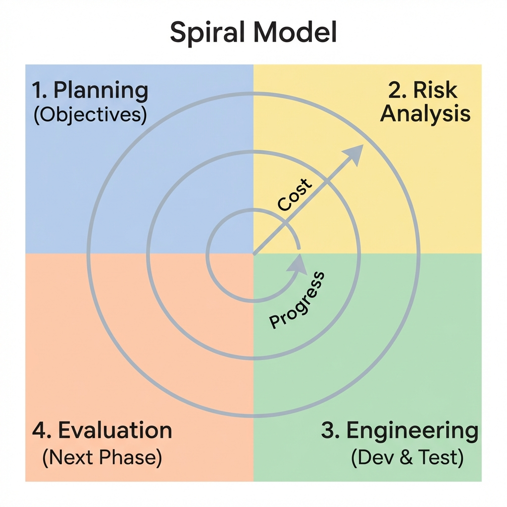

# Spiral Model

> "Risk Management is the key."

The **Spiral Model**, proposed by Barry Boehm, is the "Meta-Model" of software engineering. It combines the iterative nature of agile with the systematic control of the waterfall model, but its defining characteristic is its obsession with **Risk Analysis**.

In this model, software isn't built in a straight line. It's built in circles (spirals). Each loop represents a phase of the software process, and the project repeatedly passes through four quadrants.



## The Four Quadrants

### 1. Objectives Determination (Planning)
*   **Activity**: Identify goals, alternative solutions, and constraints.
*   **Question**: "What are we trying to achieve in this specific cycle?"

### 2. Risk Analysis & Resolution
*   **Activity**: Evaluate alternatives and identify risks (technical, cost, schedule).
*   **Key Output**: **Prototypes**. A prototype is built specifically to prove that the risk is manageable.
*   **Decision**: If risk is too high, the project might even be cancelled here.

### 3. Development & Testing (Engineering)
*   **Activity**: Write code, test, and verify.
*   **Note**: In early spirals, this might just be a "Concept of Operations" or a "Mockup". In later spirals, it's the actual production code.

### 4. Planning the Next Iteration (Evaluation)
*   **Activity**: Customer evaluates the current output. Team plans the next spiral.
*   **Decision**: "Are we ready to commit money to the next, more expensive loop?"

## Key Dimensions
*   **Radius (Distance from center)** = **Cost**. As the spiral grows outward, cumulative cost increases.
*   **Angular Dimension** = **Progress**. Each rotation completes a phase.

## When to Use? (Expert Analysis)
The Spiral Model is heavy. It is **not** for small websites or simple apps. It is for:
*   **High-Stakes Projects**: Military, Aerospace, Medical systems.
*   **Unclear Requirements**: Where you need to prototype to understand what is needed.
*   **New Technologies**: When you aren't sure if the tech stack will actually work.

## Advantages & Disadvantages

| Pros | Cons |
| :--- | :--- |
| **Risk Reduction**: Risks are killed early. | **Complexity**: Hard to manage strict spirals. |
| **Flexibility**: Changes can be adopted in the next loop. | **Cost**: Risk analysis requires expensive experts. |
| **Customer Feedback**: Constant demos via prototypes. | **Overkill**: Too much process for small projects. |

---

## Simulation

The simulation below demonstrates the **Risk Analysis** phase. Unlike other models, the Spiral model can **ABORT** a project if the risk in a loop is deemed too high to proceed.

```bash
python spiral_simulation.py
```
