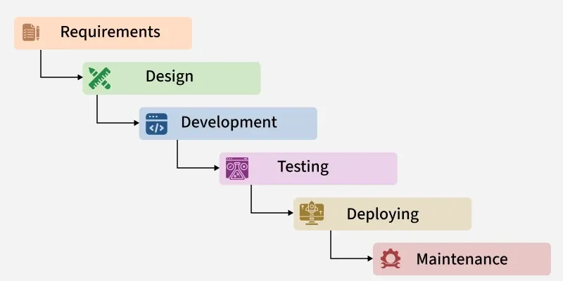

# Waterfall Model

The Waterfall Model is a traditional software development methodology that follows a linear, phase-by-phase approach. Each phase must be completed before moving to the next, similar to a waterfall flowing downwards. It is simple, well-structured, and emphasizes documentation and planning.



## Features of the Waterfall Model
*   **Sequential Approach**: Development follows a linear, step-by-step process.
*   **Document-Driven**: Detailed documentation is created at every stage.
*   **Quality Control**: Strong emphasis on verification and testing at each phase.
*   **Detailed Planning**: Scope, schedule, and deliverables are planned upfront.

## Phases of Waterfall Model

### 1. Requirements Analysis and Specification
Focuses on understanding and documenting customer needs.
*   **Gathering**: Collecting requirements from stakeholders.
*   **Specification**: Creating the **Software Requirement Specification (SRS)**, a formal agreement on what to build.

### 2. Design
Converting requirements into a system blueprint.
*   **High-Level Design (HLD)**: System architecture and major components.
*   **Low-Level Design (LLD)**: Detailed logic and data flow for components.
*   **Output**: **Software Design Document (SDD)**.

### 3. Development (Implementation)
Converting design into actual code.
*   Developers write source code.
*   Unit testing is performed on individual modules.

### 4. Testing and Deployment
Ensuring the system functions correctly and delivering it.
*   **Integration Testing**: Combining modules.
*   **System Testing**: Verifying the entire system.
*   **User Acceptance Testing (UAT)**: Customer validation.
*   **Deployment**: Releasing to the live environment.

### 5. Maintenance
Ensuring the software continues to function after release.
*   **Corrective**: Fixing bugs.
*   **Perfective**: Enhancing features.
*   **Adaptive**: Adjusting to new environments.

## Advantages
*   **Easy to Understand**: Simple linear flow.
*   **Well-Defined Stages**: Clear objectives and deliverables.
*   **Clear Milestones**: Easy to track progress.
*   **Strong Documentation**: Knowledge transfer is easier.
*   **Disciplined**: "Define before design, design before code".

## When to Use?
*   Requirements are clear and stable (unlikely to change).
*   Small to medium-sized projects.
*   Predictable and low-risk projects.
*   Strict regulatory compliance is needed.
*   Resources are limited and need careful planning.

## Example: Online Food Delivery System
1.  **Analysis**: Gather requirements for user registration, menu, orders, payment, etc.
2.  **Design**: Database schema, UI layout, API architecture.
3.  **Implementation**: Coding features like login, search, cart, payment integration.
4.  **Testing**: verifying order flow, payment success, notification delivery.
5.  **Maintenance**: Adding new restaurants, fixing bugs, updating for new OS versions.

## Code Simulation (Python)
See [waterfall_simulation.py](waterfall_simulation.py) for a programmatic representation of the strict phase dependencies.

```python
# Detailed simulation of the Waterfall process
from waterfall_simulation import WaterfallProject

project = WaterfallProject("FoodDeliveryApp")
project.start_requirements_analysis()
project.start_design()
project.start_development()
project.start_testing()
project.start_deployment()
project.start_maintenance()
```
