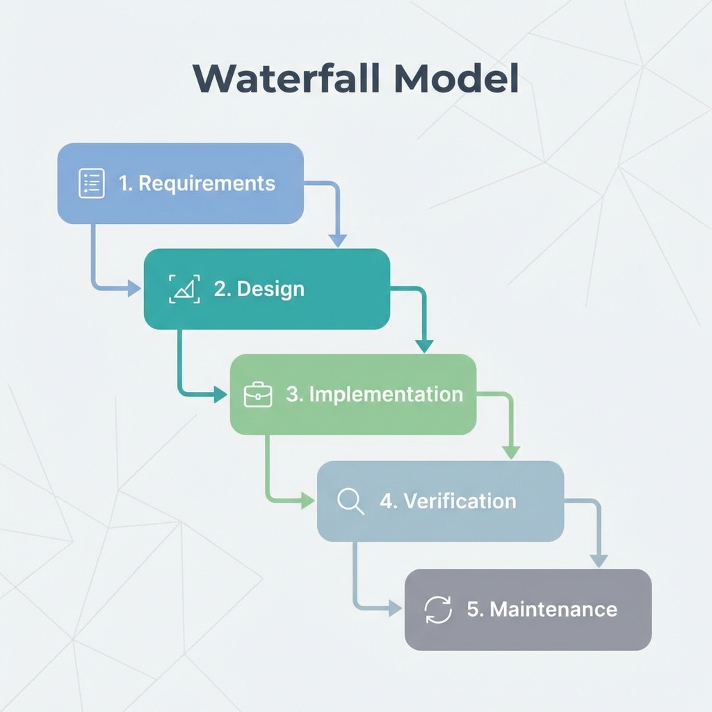

# The Waterfall Model: A Comprehensive Guide

> "Define before design, design before code."

The **Waterfall Model** is the earliest formalized software development life cycle (SDLC) methodology. It advocates for a linear, sequential approach where progress flows steadily downwards (like a waterfall) through distinct phases. It represents a disciplined, rigorous approach to software engineering, emphasizing thoroughly defined requirements and architectural integrity before a single line of code is written.



## Core Philosophy
The Waterfall model is predicated on the idea that the cost of fixing a defect increases exponentially as the project progresses. Therefore, it strives to catch errors in the earliest possible phase (e.g., Requirements or Design) rather than during Testing or Maintenance.

## The Sequential Phases

### 1. Requirements Analysis & Specification
**"What are we building?"**
This is the foundational phase. It involves deep engagement with stakeholders to capture detailed functional and non-functional requirements.
-   **Activity**: Requirement elicitation, feasibility study, defining constraints.
-   **Deliverable**: **Software Requirement Specification (SRS)**. This document acts as the "contract" for the system.

### 2. System Design
**"How will we build it?"**
This phase translates requirements into a technical blueprint.
-   **High-Level Design (HLD)**: Defines the system architecture, database design, and key modules.
-   **Low-Level Design (LLD)**: Specifies algorithms, data structures, and interface signatures for individual components.
-   **Deliverable**: **Software Design Document (SDD)**.

### 3. Implementation (Development)
**"Building the system."**
Developers write code according to the strict specifications of the SDD.
-   **Activity**: Coding, code reviews, and Unit Testing.
-   **Constraint**: Developers should not deviate from the design without formal change requests.

### 4. Verification (Testing)
**"Did we build it right?"**
Once coding is complete, the software is rigorously tested to ensure it meets the SRS.
-   **Integration Testing**: Verifying that modules work together.
-   **System Testing**: Validating the complete system against requirements.
-   **Acceptance Testing (UAT)**: User validation before go-live.

### 5. Deployment & Maintenance
**"Keeping it running."**
The system is released to production.
-   **Corrective Maintenance**: Fixing latent bugs.
-   **Perfective Maintenance**: Improving performance or maintainability.
-   **Adaptive Maintenance**: Porting to new environments (e.g., OS updates).

---

## Expert Analysis: When to Use Waterfall?

While Agile is popular today, Waterfall is still the **superior choice** in specific contexts:

| Scenario | Why Waterfall fits |
| :--- | :--- |
| **Mission-Critical Systems** | For aerospace, medical, or military software, the cost of failure is life or death. The rigor of Waterfall ensures safety. |
| **Fixed-Bid Contracts** | When budget and timeline are legally fixed, the clear milestones of Waterfall protect both client and vendor. |
| **Stable Requirements** | If you are building a compiler or a protocol implementation where requirements won't change, Waterfall is highly efficient. |
| **Low Technical Risk** | If the team uses a known technology stack for a familiar problem domain, the planning overhead of Agile may be unnecessary. |

## Pros & Cons

### Advantages
*   **Predictability**: Start and end dates for each phase are known.
*   **Discipline**: Enforces structure and documentation.
*   **Traceability**: Every line of code can be traced back to a specific design element and requirement.

### Disadvantages
*   **Inflexibility**: Changing a requirement late in the cycle is extremely costly (requires "swimming upstream").
*   **Late Value Delivery**: Working software is only produced at the very end of the lifecycle.
*   **"Analysis Paralysis"**: Teams can get stuck perfecting documents before building anything.

---

## Simulation

To truly understand the **strict dependencies** of the Waterfall model, run the included Python simulation. It demonstrates how you strictly cannot proceed to the next phase until the previous one is signed off.

```bash
python waterfall_simulation.py
```
